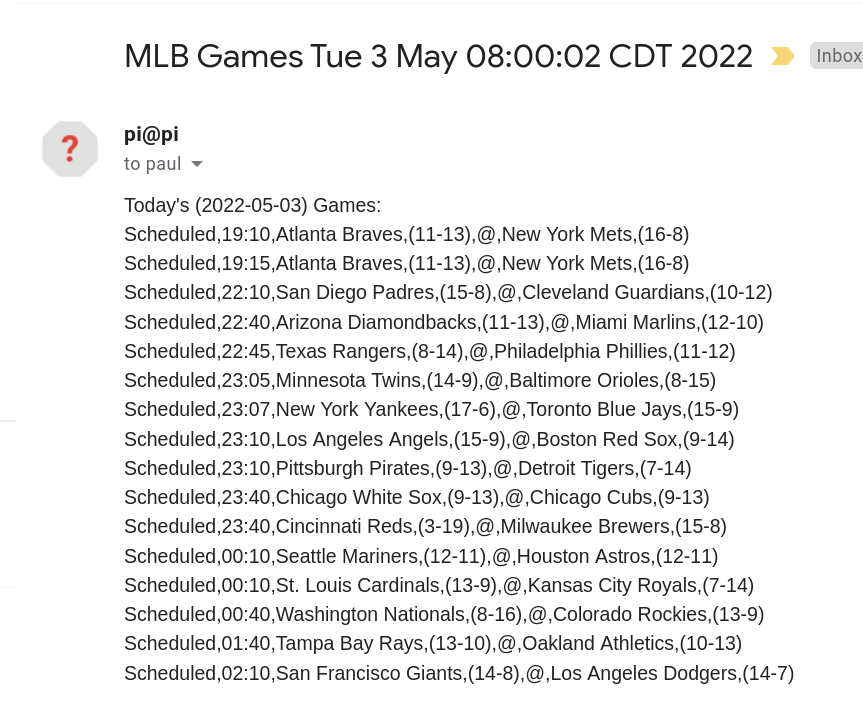
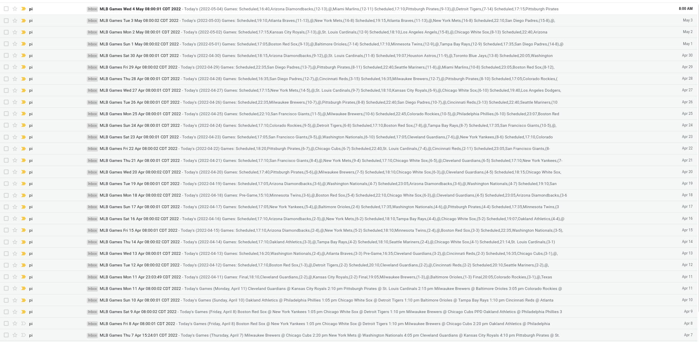

Web scraping is almost always a less than ideal solution. When the web source changes you've got a pile of garbage.

A better solution is an API. Major League Baseball provides a stats API. It's predominately a paid resource, but they have a few endpoints you can access without a key.

## API Endpoint

I found the endpoint: `https://statsapi.mlb.com/api/v1/schedule?sportId=1&date=2022-04-15`

Which results in a bunch of tasty JSON.

Example JSON:

```json
{
  "copyright" : "Copyright 2022 MLB Advanced Media, L.P.  Use of any content on this page acknowledges agreement to the terms posted here http://gdx.mlb.com/components/copyright.txt",
  "totalItems" : 15,
  "totalEvents" : 0,
  "totalGames" : 15,
  "totalGamesInProgress" : 0,
  "dates" : [ {
    "date" : "2022-04-15",
    "totalItems" : 15,
    "totalEvents" : 0,
    "totalGames" : 15,
    "totalGamesInProgress" : 0,
    "games" : [ {
      "gamePk" : 662485,
      "link" : "/api/v1.1/game/662485/feed/live",
      "gameType" : "R",
      "season" : "2022",
      "gameDate" : "2022-04-15T17:10:00Z",
      "officialDate" : "2022-04-15",
      "status" : {
        "abstractGameState" : "Final",
        "codedGameState" : "F",
        "detailedState" : "Final",
        "statusCode" : "F",
        "startTimeTBD" : false,
        "abstractGameCode" : "F"
      },
      "teams" : {
        "away" : {
          "leagueRecord" : {
            "wins" : 2,
            "losses" : 5,
            "pct" : ".286"
          },
          "score" : 3,
          "team" : {
            "id" : 109,
            "name" : "Arizona Diamondbacks",
            "link" : "/api/v1/teams/109"
          },
          "isWinner" : false,
          "splitSquad" : false,
          "seriesNumber" : 3
        },
...trimmed
}
```

### Copyright

One of the keys in the JSON response is the following [`copyright`](http://gdx.mlb.com/components/copyright.txt):

```txt
The accounts, descriptions, data and presentation in the referring page (the "Materials") are proprietary content of MLB Advanced Media, L.P ("MLBAM").  
Only individual, non-commercial, non-bulk use of the Materials is permitted and any other use of the Materials is prohibited without prior written authorization from MLBAM.  
Authorized users of the Materials are prohibited from using the Materials in any commercial manner other than as expressly authorized by MLBAM.
```

I can use this data. I'm not commercializing it, this blog has no adds, and does not make me any money.

I'm an individual, and I'm not bulk using the contents. I just make a simple request once a day.

### Save Output

So I'm not hitting the API tons of times while I figure out how to trim down the data, let's make the request and save the output:

```bash
curl -s 'https://statsapi.mlb.com/api/v1/schedule?sportId=1&date=2022-04-15' > example
```

## `jq`

Since I'm dealing with JSON I can use a JSON parsing tool.

Enter [`jq` a lightweight command-line JSON processor](https://stedolan.github.io/jq/).

Supposedly it's like `sed`I can slice, filter and map JSON structured data. That's exactly what I need.

### Filters

### Just today's games:

```jq
cat example | jq '.dates[0].games[]'
```

Output:

```json
{
  "gamePk": 662485,
  "link": "/api/v1.1/game/662485/feed/live",
  "gameType": "R",
  "season": "2022",
  "gameDate": "2022-04-15T17:10:00Z",
  "officialDate": "2022-04-15",
  "status": {
    "abstractGameState": "Final",
    "codedGameState": "F",
    "detailedState": "Final",
    "statusCode": "F",
    "startTimeTBD": false,
    "abstractGameCode": "F"
  },
  "teams": {
    "away": {
      "leagueRecord": {
        "wins": 2,
        "losses": 5,
        "pct": ".286"
      },
      "score": 3,
      "team": {
        "id": 109,
        "name": "Arizona Diamondbacks",
        "link": "/api/v1/teams/109"
      },
      "isWinner": false,
      "splitSquad": false,
      "seriesNumber": 3
    },
    "home": {
      "leagueRecord": {
        "wins": 6,
        "losses": 2,
        "pct": ".750"
      },
      "score": 10,
      "team": {
        "id": 121,
        "name": "New York Mets",
        "link": "/api/v1/teams/121"
      },
      "isWinner": true,
      "splitSquad": false,
      "seriesNumber": 3
    }
  },
  "venue": {
    "id": 3289,
    "name": "Citi Field",
    "link": "/api/v1/venues/3289"
  },
  "content": {
    "link": "/api/v1/game/662485/content"
  },
  "isTie": false,
  "gameNumber": 1,
  "publicFacing": true,
  "doubleHeader": "N",
  "gamedayType": "P",
  "tiebreaker": "N",
  "calendarEventID": "14-662485-2022-04-15",
  "seasonDisplay": "2022",
  "dayNight": "day",
  "description": "Mets home opener - Jackie Robinson Day",
  "scheduledInnings": 9,
  "reverseHomeAwayStatus": false,
  "inningBreakLength": 120,
  "gamesInSeries": 3,
  "seriesGameNumber": 1,
  "seriesDescription": "Regular Season",
  "recordSource": "S",
  "ifNecessary": "N",
  "ifNecessaryDescription": "Normal Game"
}
```

One of these for each game on the date.

### Status of each of today's games:

```jq
cat example | jq '.dates[0].games[]' | jq '.status.detailedState'
```

Output:

```json
"Final"
"Final"
"Final"
"Final"
"Final"
"Final"
"Final"
"Final"
"Final"
"Final"
"Final"
"Final"
"Final"
"Final"
"Final"
```

All of the games on 2022-04-15 are at `Final` time. That makes sense it is 2022-05-03.

Let's look at tomorrows:

```jq
curl -s 'https://statsapi.mlb.com/api/v1/schedule?sportId=1&date=2022-04-15' | jq '.dates[0].games[]' | jq '.status.detailedState'
```

Output:

```json
"Scheduled"
"Scheduled"
"Scheduled"
"Scheduled"
"Scheduled"
"Scheduled"
"Scheduled"
"Scheduled"
"Scheduled"
"Scheduled"
"Scheduled"
"Scheduled"
"Scheduled"
"Scheduled"
"Scheduled"
"Scheduled"
"Scheduled"
```

### Date of each game

```jq
cat example | jq '.dates[0].games[]' | jq '.gameDate'
```

Output:

```json
"2022-04-15T17:10:00Z"
"2022-04-15T18:10:00Z"
"2022-04-15T22:35:00Z"
"2022-04-15T22:40:00Z"
"2022-04-15T23:05:00Z"
"2022-04-15T23:07:00Z"
"2022-04-15T23:10:00Z"
"2022-04-15T23:10:00Z"
"2022-04-16T00:05:00Z"
"2022-04-16T00:10:00Z"
"2022-04-16T00:10:00Z"
"2022-04-16T00:40:00Z"
"2022-04-16T01:40:00Z"
"2022-04-16T01:42:00Z"
"2022-04-16T02:10:00Z"
```

What about just the time?

```jq
cat example | jq '.dates[0].games[]' | jq '.gameDate[11:16]'
```

Output:

```json
"17:10"
"18:10"
"22:35"
"22:40"
"23:05"
"23:07"
"23:10"
"23:10"
"00:05"
"00:10"
"00:10"
"00:40"
"01:40"
"01:42"
"02:10"
```

Much better. I already now the date of the games, but I do not know the time of each game.

### Away Team

```jq
cat example | jq '.dates[0].games[]' | jq '.teams.away.team.name'
```

Output:

```json
"Arizona Diamondbacks"
"Minnesota Twins"
"Washington Nationals"
"Philadelphia Phillies"
"New York Yankees"
"Oakland Athletics"
"San Francisco Giants"
"Tampa Bay Rays"
"Los Angeles Angels"
"Detroit Tigers"
"St. Louis Cardinals"
"Chicago Cubs"
"Atlanta Braves"
"Houston Astros"
"Cincinnati Reds"
```

### Away Team Record

```jq
cat example | jq '.dates[0].games[]' | jq '.teams.away.leagueRecord.wins'
```

output:

```json
2
3
4
3
4
4
5
4
4
4
4
4
4
4
2
```

```jq
cat example | jq '.dates[0].games[]' | jq '.teams.away.leagueRecord.losses'
```

output:

```json
5
4
5
5
4
4
2
4
4
4
2
3
5
3
6
```

### Home Team

```jq
cat example | jq '.dates[0].games[]' | jq '.teams.home.team.name, .teams.home.leagueRecord.wins, .teams.home.leagueRecord.losses'
```

output:

```json
"New York Mets"
6
2
"Boston Red Sox"
3
4
"Pittsburgh Pirates"
3
4
"Miami Marlins"
3
4
"Baltimore Orioles"
2
5
"Toronto Blue Jays"
5
3
"Cleveland Guardians"
4
3
"Chicago White Sox"
5
2
"Texas Rangers"
2
5
"Kansas City Royals"
2
5
"Milwaukee Brewers"
4
4
"Colorado Rockies"
5
2
"San Diego Padres"
5
4
"Seattle Mariners"
4
4
"Los Angeles Dodgers"
5
2

```

This is more workable. Let's combine all of that filtering to get the data I want.

## Altogether

```jq
cat example | jq '.dates[0].games[]' | jq '.status.detailedState, .gameDate[11:16], .teams.away.team.name, "(", .teams.away.leagueRecord.wins, "-", .teams.away.leagueRecord.losses, ")", "@", .teams.home.team.name, "(", .teams.home.leagueRecord.wins, "-", .teams.home.leagueRecord.losses, ")"'
```

output:

```json
"Final"
"17:10"
"Arizona Diamondbacks"
"("
2
"-"
5
")"
"@"
"New York Mets"
"("
6
"-"
2
")"
"Final"
"18:10"
"Minnesota Twins"
"("
3
"-"
4
")"
"@"
"Boston Red Sox"
"("
3
"-"
4
")"
"Final"
"22:35"
"Washington Nationals"
"("
4
"-"
5
")"
"@"
"Pittsburgh Pirates"
"("
3
"-"
4
")"
"Final"
"22:40"
"Philadelphia Phillies"
"("
3
"-"
5
")"
"@"
"Miami Marlins"
"("
3
"-"
4
")"
"Final"
"23:05"
"New York Yankees"
"("
4
"-"
4
")"
"@"
"Baltimore Orioles"
"("
2
"-"
5
")"
"Final"
"23:07"
"Oakland Athletics"
"("
4
"-"
4
")"
"@"
"Toronto Blue Jays"
"("
5
"-"
3
")"
"Final"
"23:10"
"San Francisco Giants"
"("
5
"-"
2
")"
"@"
"Cleveland Guardians"
"("
4
"-"
3
")"
"Final"
"23:10"
"Tampa Bay Rays"
"("
4
"-"
4
")"
"@"
"Chicago White Sox"
"("
5
"-"
2
")"
"Final"
"00:05"
"Los Angeles Angels"
"("
4
"-"
4
")"
"@"
"Texas Rangers"
"("
2
"-"
5
")"
"Final"
"00:10"
"Detroit Tigers"
"("
4
"-"
4
")"
"@"
"Kansas City Royals"
"("
2
"-"
5
")"
"Final"
"00:10"
"St. Louis Cardinals"
"("
4
"-"
2
")"
"@"
"Milwaukee Brewers"
"("
4
"-"
4
")"
"Final"
"00:40"
"Chicago Cubs"
"("
4
"-"
3
")"
"@"
"Colorado Rockies"
"("
5
"-"
2
")"
"Final"
"01:40"
"Atlanta Braves"
"("
4
"-"
5
")"
"@"
"San Diego Padres"
"("
5
"-"
4
")"
"Final"
"01:42"
"Houston Astros"
"("
4
"-"
3
")"
"@"
"Seattle Mariners"
"("
4
"-"
4
")"
"Final"
"02:10"
"Cincinnati Reds"
"("
2
"-"
6
")"
"@"
"Los Angeles Dodgers"
"("
5
"-"
2
")"
```

{}
A couple of additional strings were added in here to transform STDOUT to a fashion I consider to be more readable.
{}

This is something I can work with. I can easily trim up this output with `sed` to make it more readable.

### `sed`

Get the matchup data on each line.

```bash
cat example | jq '.dates[0].games[]' | jq '.status.detailedState, .gameDate[11:16], .teams.away.team.name, "(", .teams.away.leagueRecord.wins, "-", .teams.away.leagueRecord.losses, ")", "@", .teams.home.team.name, "(", .teams.home.leagueRecord.wins, "-", .teams.home.leagueRecord.losses, ")"' | sed 'N;N;N;N;N;N;N;N;N;N;N;N;N;N;s/\n/,/g'
```

output:

```csv
"Final","17:10","Arizona Diamondbacks","(",2,"-",5,")","@","New York Mets","(",6,"-",2,")"
"Final","18:10","Minnesota Twins","(",3,"-",4,")","@","Boston Red Sox","(",3,"-",4,")"
"Final","22:35","Washington Nationals","(",4,"-",5,")","@","Pittsburgh Pirates","(",3,"-",4,")"
"Final","22:40","Philadelphia Phillies","(",3,"-",5,")","@","Miami Marlins","(",3,"-",4,")"
"Final","23:05","New York Yankees","(",4,"-",4,")","@","Baltimore Orioles","(",2,"-",5,")"
"Final","23:07","Oakland Athletics","(",4,"-",4,")","@","Toronto Blue Jays","(",5,"-",3,")"
"Final","23:10","San Francisco Giants","(",5,"-",2,")","@","Cleveland Guardians","(",4,"-",3,")"
"Final","23:10","Tampa Bay Rays","(",4,"-",4,")","@","Chicago White Sox","(",5,"-",2,")"
"Final","00:05","Los Angeles Angels","(",4,"-",4,")","@","Texas Rangers","(",2,"-",5,")"
"Final","00:10","Detroit Tigers","(",4,"-",4,")","@","Kansas City Royals","(",2,"-",5,")"
"Final","00:10","St. Louis Cardinals","(",4,"-",2,")","@","Milwaukee Brewers","(",4,"-",4,")"
"Final","00:40","Chicago Cubs","(",4,"-",3,")","@","Colorado Rockies","(",5,"-",2,")"
"Final","01:40","Atlanta Braves","(",4,"-",5,")","@","San Diego Padres","(",5,"-",4,")"
"Final","01:42","Houston Astros","(",4,"-",3,")","@","Seattle Mariners","(",4,"-",4,")"
"Final","02:10","Cincinnati Reds","(",2,"-",6,")","@","Los Angeles Dodgers","(",5,"-",2,")"
```

Trim out the double quotes

```bash
cat example | jq '.dates[0].games[]' | jq '.status.detailedState, .gameDate[11:16], .teams.away.team.name, "(", .teams.away.leagueRecord.wins, "-", .teams.away.leagueRecord.losses, ")", "@", .teams.home.team.name, "(", .teams.home.leagueRecord.wins, "-", .teams.home.leagueRecord.losses, ")"' | sed 'N;N;N;N;N;N;N;N;N;N;N;N;N;N;s/\n/,/g' | sed 's/"//g'
```

output:

```csv
Final,17:10,Arizona Diamondbacks,(,2,-,5,),@,New York Mets,(,6,-,2,)
Final,18:10,Minnesota Twins,(,3,-,4,),@,Boston Red Sox,(,3,-,4,)
Final,22:35,Washington Nationals,(,4,-,5,),@,Pittsburgh Pirates,(,3,-,4,)
Final,22:40,Philadelphia Phillies,(,3,-,5,),@,Miami Marlins,(,3,-,4,)
Final,23:05,New York Yankees,(,4,-,4,),@,Baltimore Orioles,(,2,-,5,)
Final,23:07,Oakland Athletics,(,4,-,4,),@,Toronto Blue Jays,(,5,-,3,)
Final,23:10,San Francisco Giants,(,5,-,2,),@,Cleveland Guardians,(,4,-,3,)
Final,23:10,Tampa Bay Rays,(,4,-,4,),@,Chicago White Sox,(,5,-,2,)
Final,00:05,Los Angeles Angels,(,4,-,4,),@,Texas Rangers,(,2,-,5,)
Final,00:10,Detroit Tigers,(,4,-,4,),@,Kansas City Royals,(,2,-,5,)
Final,00:10,St. Louis Cardinals,(,4,-,2,),@,Milwaukee Brewers,(,4,-,4,)
Final,00:40,Chicago Cubs,(,4,-,3,),@,Colorado Rockies,(,5,-,2,)
Final,01:40,Atlanta Braves,(,4,-,5,),@,San Diego Padres,(,5,-,4,)
Final,01:42,Houston Astros,(,4,-,3,),@,Seattle Mariners,(,4,-,4,)
Final,02:10,Cincinnati Reds,(,2,-,6,),@,Los Angeles Dodgers,(,5,-,2,)
```

Trim out extra commas in parenthesis:

```bash
cat example | jq '.dates[0].games[]' | jq '.status.detailedState, .gameDate[11:16], .teams.away.team.name, "(", .teams.away.leagueRecord.wins, "-", .teams.away.leagueRecord.losses, ")", "@", .teams.home.team.name, "(", .teams.home.leagueRecord.wins, "-", .teams.home.leagueRecord.losses, ")"' | sed 'N;N;N;N;N;N;N;N;N;N;N;N;N;N;s/\n/,/g' | sed 's/"//g' | sed 's/(,\([0-9]*\),-,\([0-9]*\),)/(\1-\2)/g'
```

output:

```csv
Final,17:10,Arizona Diamondbacks,(2-5),@,New York Mets,(6-2)
Final,18:10,Minnesota Twins,(3-4),@,Boston Red Sox,(3-4)
Final,22:35,Washington Nationals,(4-5),@,Pittsburgh Pirates,(3-4)
Final,22:40,Philadelphia Phillies,(3-5),@,Miami Marlins,(3-4)
Final,23:05,New York Yankees,(4-4),@,Baltimore Orioles,(2-5)
Final,23:07,Oakland Athletics,(4-4),@,Toronto Blue Jays,(5-3)
Final,23:10,San Francisco Giants,(5-2),@,Cleveland Guardians,(4-3)
Final,23:10,Tampa Bay Rays,(4-4),@,Chicago White Sox,(5-2)
Final,00:05,Los Angeles Angels,(4-4),@,Texas Rangers,(2-5)
Final,00:10,Detroit Tigers,(4-4),@,Kansas City Royals,(2-5)
Final,00:10,St. Louis Cardinals,(4-2),@,Milwaukee Brewers,(4-4)
Final,00:40,Chicago Cubs,(4-3),@,Colorado Rockies,(5-2)
Final,01:40,Atlanta Braves,(4-5),@,San Diego Padres,(5-4)
Final,01:42,Houston Astros,(4-3),@,Seattle Mariners,(4-4)
Final,02:10,Cincinnati Reds,(2-6),@,Los Angeles Dodgers,(5-2)
```

Very nice.

## In a Script

Put the whole thing in a script: `daily-schedule.sh`.

```bash
d=$(date +%Y-%m-%d)

curl -s "https://statsapi.mlb.com/api/v1/schedule?sportId=1&date=$d" > /home/pi/.baseball/today.schedule

cat /home/pi/.baseball/today.schedule | jq '.dates[0].games[]' | jq '.status.detailedState, .gameDate[11:16], .teams.away.team.name, "(", .teams.away.leagueRecord.wins, "-", .teams.away.leagueRecord.losses, ")", "@", .teams.home.team.name, "(", .teams.home.leagueRecord.wins, "-", .teams.home.leagueRecord.losses, ")"' > /home/pi/.baseball/daily.schedule.txt

touch /home/pi/.baseball/daily-schedule.csv
rm /home/pi/.baseball/daily-schedule.csv

echo "Today's ($d) Games:" > /home/pi/.baseball/daily-schedule.csv

sed 'N;N;N;N;N;N;N;N;N;N;N;N;N;N;s/\n/,/g' /home/pi/.baseball/daily.schedule.txt | sed 's/"//g' | sed 's/(,\([0-9]*\),-,\([0-9]*\),)/(\1-\2)/g' >> /home/pi/.baseball/daily-schedule.csv

rm /home/pi/.baseball/today.schedule
rm /home/pi/.baseball/daily.schedule.txt
```

## Cron Script

Create one master script that invokes the `daily-schedule.sh` script and sends me an email called: `baseball`.

```bash
#!/bin/bash

bash /home/pi/.baseball/daily-schedule.sh

mail -s "MLB Games $(date)" 'paul@paulmatthews.dev' < /home/pi/.baseball/daily-schedule.csv
```

## Crontab

```cron
0 8 * * * bash /home/pi/.baseball/baseball
```

## My Inbox at 8:00am



Everyday I get a nice little email with the times, matchups, and records of all scheduled games.

{}
I wrote this script and set it up on my raspberry pi about a month ago. Here is a picture of all of the emails I've received `From: pi@pi`:

Including the one I got 10 minutes ago on May 4th!
{}