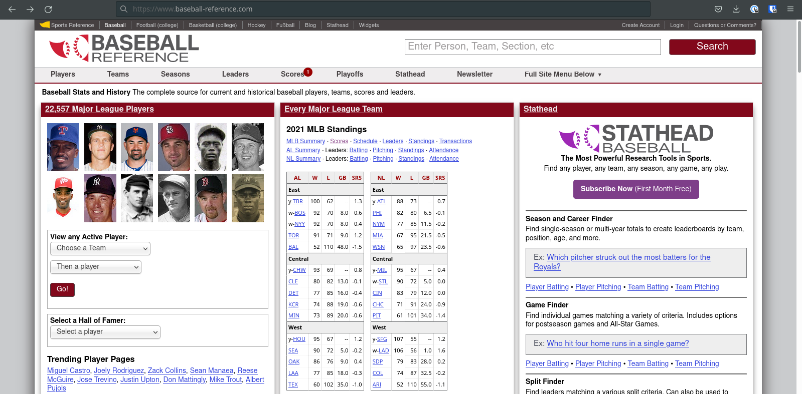
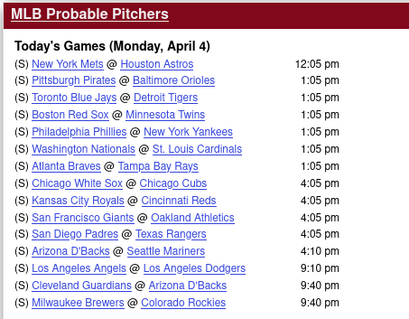
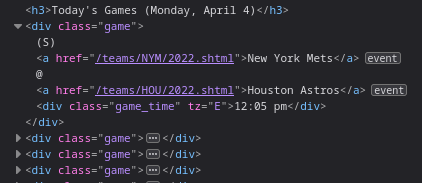
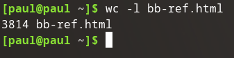
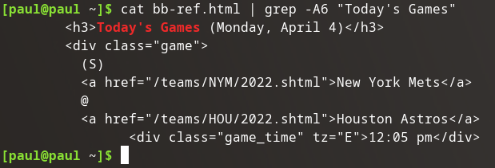

## Get Data

So many ways. I'm going to use curl:

```bash
curl -s https://www.baseball-reference.com/ > bb-ref.html
```

## Explore Data

### Website

Baseball Reference is a fantastic website. I look up all kind of stats on here throughout the year.



I don't want all the information on this page, I'm really only interested in the matchups of the day, however there is a little section that contains this information:



And the HTML of this section:



This I can work with.



3841 lines of HTML is waaaayy too much. I'll need to extract just the section I want.

## Extract Data

```bash
cat bb-ref.html | grep -A6 "<h3>Today's Games"
```



This is pretty close to what I want, but I don't just want the first game, I want all the games.

```bash
cat bb-ref.html | grep -A105 "<h3>Today's Games"
```

That's better, but what about days when not every team plays, it will load down into the next days games...

```bash
cat bb-ref.html | grep -zo "<h3>Today's Games.*<h3>"
```

There we go. It will now grab everything between the `<h3>Today's Games` and the next `<h3>` tag which is used at the next section.

## Trim Data

Right now the matchup data is spread out over multiple lines like this:

```bash
<div class="game">
  (S)
  <a href="/teams/MIL/2022.shtml">Milwaukee Brewers</a>
  @
  <a href="/teams/COL/2022.shtml">Colorado Rockies</a>
        <div class="game_time" tz="E">9:40 pm</div>
</div>
```

I want to trim out all of the tags.

### Trim `(S)`

```bash
cat bb-ref.html | grep -zo "<h3>Today's games.*<h3>" | sed 's/(S)//g'
```

Resulting in:

```bash
<div class="game">

  <a href="/teams/MIL/2022.shtml">Milwaukee Brewers</a>
  @
  <a href="/teams/COL/2022.shtml">Colorado Rockies</a>
        <div class="game_time" tz="E">9:40 pm</div>
</div>
```

Goodbye `(S)`!

### Trim `<div>`s

```bash
cat bb-ref.html | grep -zo "<h3>Today's games.*<h3>" | sed 's/(S)//g' | sed 's/<\/*div[^>]*>//g`
```

Resulting in:

```bash


  <a href="/teams/MIL/2022.shtml">Milwaukee Brewers</a>
  @
  <a href="/teams/COL/2022.shtml">Colorado Rockies</a>
        9:40 pm
```

Goodbye `<div>`s!

### Trim `<a>`s

```bash
cat bb-ref.html | grep -zo "<h3>Today's games.*<h3>" | sed 's/(S)//g' | sed 's/<\/*div[^>]*>//g' | sed 's/<\/*a[^>]*>//g'
```

Resulting in:

```bash


  Milwaukee Brewers
  @
  Colorado Rockies
        9:40 pm
```

Now this is almost usable data.

### Refactor

```bash
cat bb-ref.html | grep -zo "<h3>Today's Games.*<h3>" | sed 's/(S)//g' | sed 's/<\/*[^>]*>//g'
```

Resulting in:

```bash


    Milwaukee Brewers
    @
    Colorado Rockies
        9:40 pm
```

Goodbye all HTML tags!

### Trim Whitespace

```bash
cat bb-ref.html | grep -zo "<h3>Today's Games.*<h3>" | sed 's/(S)//g' | sed 's/<\/*[^>]*>//g' | sed '/^[[:space:]]*$/d'
```

Resulting in:

```bash
    Milwaukee Brewers
    @
    Colorado Rockies
        9:40 pm
```

Closer. Let's left justify.

### Left Justify

```bash
cat bb-ref.html | grep -zo "<h3>Today's Games.*<h3>" | sed 's/(S)//g' | sed 's/<\/*[^>]*>//g' | sed '/^[[:space:]]*$/d' | awk '{$1=$1;print}'
```

Resulting in:

```bash
Milwaukee Brewers
@
Colorado Rockies
9:40 pm
```

## Merge Lines

I want to convert:

```bash
Today's Games (Monday, April 4)
New York Mets
@
Houston Astros
12:05 pm
Pittsburgh Pirates
@
Baltimore Orioles
1:05 pm
```

To this:

```bash
Today's Games (Monday, April 4)
New York Mets @ Houston Astros 12:05 pm
Pittsburch Pirates @ Baltimore Orioles 1:05 pm
```

More sed:

```bash
cat bb-ref.html | grep -zo "<h3>Today's Games.*<h3>" | sed 's/(S)//g' | sed 's/<\/*[^>]*>//g' | sed '/^[[:space:]]*$/d' | awk '{$1=$1;print}' | sed -e '2,${N;N;N;s/\n/ /g}'
```

Resulting in:

```bash
Today's Games (Monday, April 4)
New York Mets @ Houston Astros 12:05 pm
Pittsburgh Pirates @ Baltimore Orioles 1:05 pm

```

That's what I'm looking for.

## Write Data

```bash
cat bb-ref.html | grep -zo "<h3>Today's Games.*<h3>" | sed 's/(S)//g' | sed 's/<\/*[^>]*>//g' | sed '/^[[:space:]]*$/d' | awk '{$1=$1;print}' | sed -e '2,${N;N;N;s/\n/ /g}' > bb-ref.schedule
```

Resulting in:

```bash
Today's Games (Monday, April 4)
New York Mets @ Houston Astros 12:05 pm
Pittsburgh Pirates @ Baltimore Orioles 1:05 pm
Toronto Blue Jays @ Detroit Tigers 1:05 pm
Boston Red Sox @ Minnesota Twins 1:05 pm
Philadelphia Phillies @ New York Yankees 1:05 pm
Washington Nationals @ St. Louis Cardinals 1:05 pm
Atlanta Braves @ Tampa Bay Rays 1:05 pm
Chicago White Sox @ Chicago Cubs 4:05 pm
Kansas City Royals @ Cincinnati Reds 4:05 pm
San Francisco Giants @ Oakland Athletics 4:05 pm
San Diego Padres @ Texas Rangers 4:05 pm
Arizona D'Backs @ Seattle Mariners 4:10 pm
Los Angeles Angels @ Los Angeles Dodgers 9:10 pm
Cleveland Guardians @ Arizona D'Backs 9:40 pm
Milwaukee Brewers @ Colorado Rockies 9:40 pm

```

Right on the money and stored in the file: `bb-ref.schedule`.

## Altogether

```bash
curl -s https://www.baseball-reference.com/  | grep -zo "<h3>Today's Games.*<h3>" | sed 's/(S)//g' | sed 's/<\/*[^>]*>//g' | sed '/^[[:space:]]*$/d' | awk '{$1=$1;print}' | sed -e '2,${N;N;N;s/\n/ /g}' > bb-ref.schedule
```

One executable command that creates a daily MLB schedule in a file. I'd like to migrate this to a raspberry pi, schedule it to run everyday at 4:00 am, and to email me the contents of the file. But that's a task for another day.