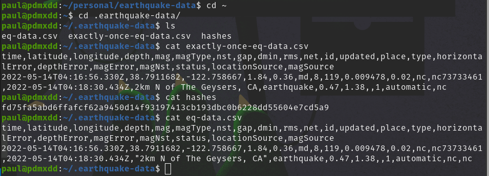
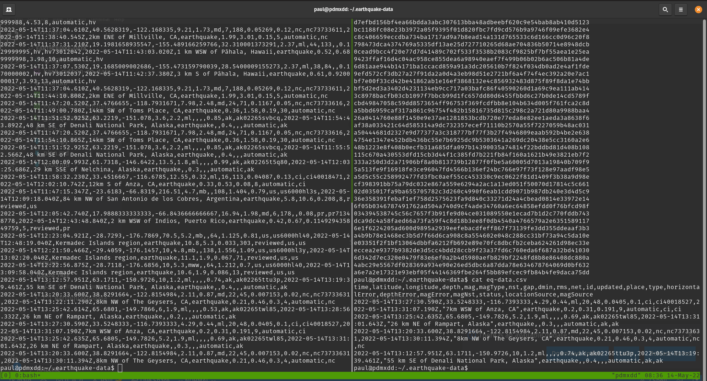
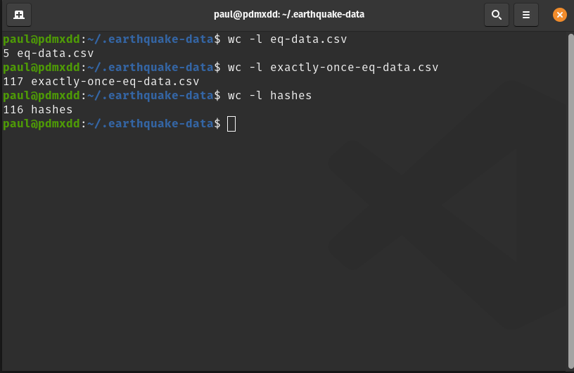

I will want this python script to run after every request for new data, currently be handled by cron and a bash script.

## Bash Script Additions:

```bash
#!/bin/bash

if [ ! -d ~/.earthquake-data ]; then
mkdir ~/.earthquake-data
fi

if [ ! -f ~/.earthquake-data/hashes ]; then
touch ~/.earthquake-data/hashes
fi

if [ ! -f ~/.earthquake-data/exactly-once-eq-data.csv ]; then
echo "time,latitude,longitude,depth,mag,magType,nst,gap,dmin,rms,net,id,updated,place,type,horizontalError,depthError,magError,magNst,status,locationSource,magSource" > ~/.earthquake-data/exactly-once-eq-data.csv
fi

curl -s https://earthquake.usgs.gov/earthquakes/feed/v1.0/summary/all_hour.csv > ~/.earthquake-data/eq-data.csv

/usr/bin/python3 ~/personal/earthquake-data/main.py
```

Quite a few things are happening here:

1. checking that the directories and files that hold my data are in place, and if not creating them
1. running the curl request, but writing to this new location
1. firing the python script that was written in the last step

Now without even updating `cron` It should start filling up with data.

## Validations

I ran my script immediately after creating it without cron and got the following output:



Data exists in the location (`/home/paul/.earthquake-data/`) I was looking for including:

1. `eq-data.csv`
1. `hashes`
1. `exactly-once-eq-data.csv`

I left my computer on, and went to sleep.

The following morning I was greeted with:



Lots of data! So much I had to use `tmux` to split my terminal to display almost all of the data. 

Let's see exactly how much data and that our hashes should match the records exactly:



Even though there are only 5 records in `eq-data.csv` there are 116 hashes in `hashes` and 116 records (+1 header) in `exactly-once-eq-data.csv`. I believe I accomplished my goal.

What a fun project!