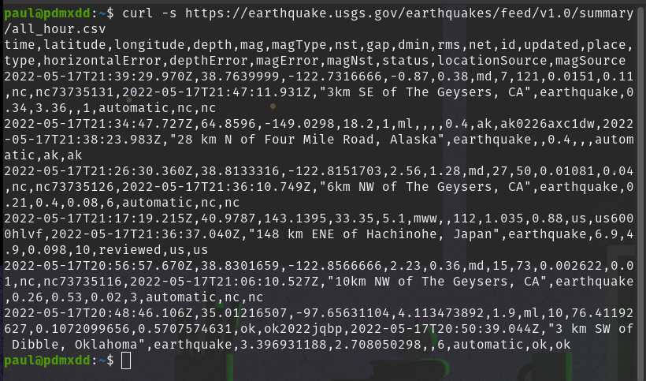

First up I need to build some system of delivering repeated requests to a web location to download a `CSV` file.

This should not be hard I have done this a lot.

## First Request

```bash
curl -s https://earthquake.usgs.gov/earthquakes/feed/v1.0/summary/all_hour.csv
```



Nice!

Now just a matter of saving that nice `STDOUT` to a file.

```bash
curl -s https://earthquake.usgs.gov/earthquakes/feed/v1.0/summary/all_hour.csv > eq-data.csv
```

## Bash

Always a good idea to put repeated terminal commands into a bash script so that they don't get lost.

I created `get-eq-data.bash` and added the command.

## Cron

With a bash script I can now create a cron job for running this task every five minutes:

```cron
*/5 * * * * /bin/bash /home/paul/personal/earthquake-data/get-eq-data.bash
```

Now every five minutes the script will fire and create a new CSV file with the past 60 minutes of geo events.

## Concern

I planned for this, but if I make a request every 5 minutes and the data is updated every 1 minute and contains 60 minutes worth of data, the data in the requested CSV **won't fall off, until 60 minutes have gone by**!

This means I would be heavily duplicating data. Essentially every request would have 55 minutes of duplicate data.

I will need some way to suss out what records have already been stored.

I decided in planning I would do this with Python since it's a language I have used a lot.