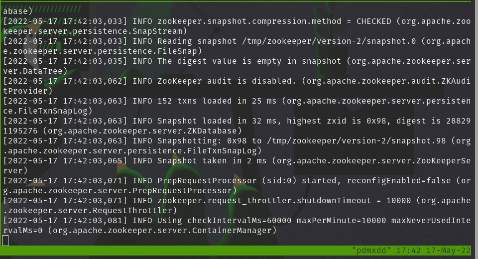
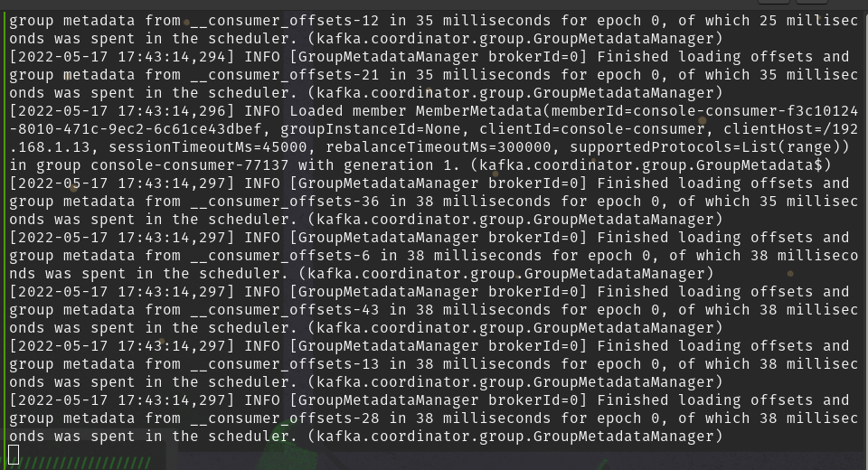
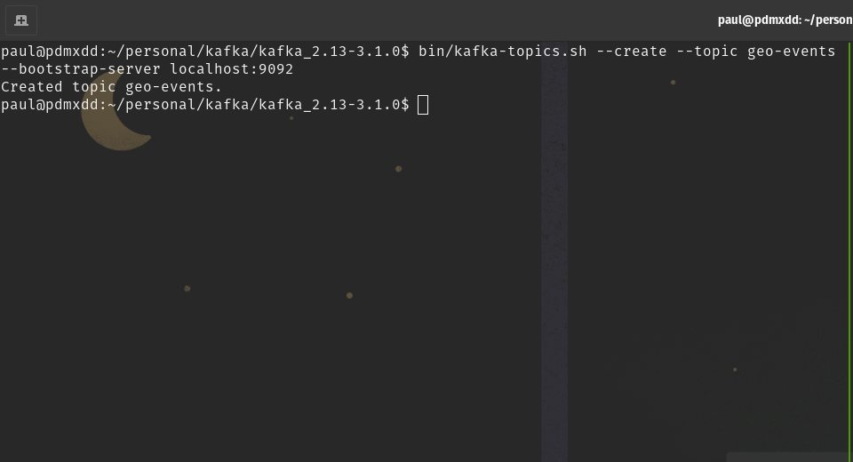

The Kafka work will be predominately handled in `Scala`. However, I need to start the Kafka server and create the `geo-events` topic.

{}
All of the commands are being fired with the `CWD` to the root of the kafka installation (`/home/paul/personal/kafka/kafka_2.13-3.1.0/` on my pop_OS! machine).
{}

## Start Zookeeper

```bash
bin/zookeeper-server-start.sh config/zookeeper.properties
```

### Validation



## Start Kafka Server

```bash
bin/kafka-server-start.sh config/server.properties
```

### Validation



## Create Topic

```bash
bin/kafka-topics.sh --create --topic geo-events --bootstrap-server localhost:9092
```

### Validation



With the server up and running and the `geo-events` topic created, time to move to `Scala`.