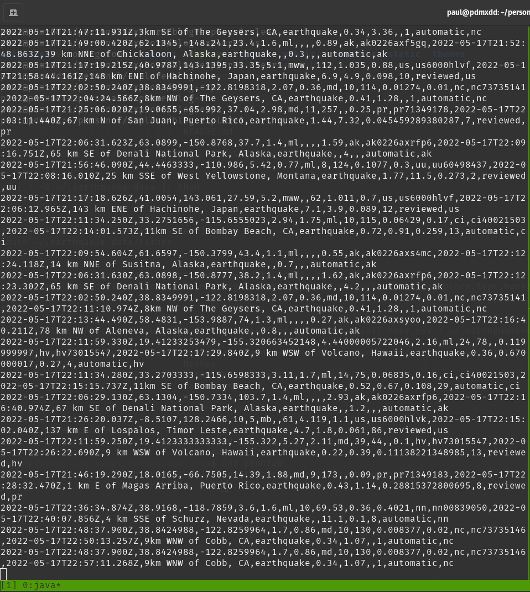
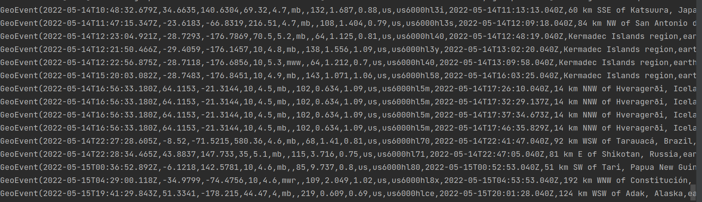

Alright time to write some Scala code to:

1. read in the `exactly-once-eq-data.csv` file
1. dump the records into the `geo-events` topic with a `KafkaProducer`
1. read the contents out of the `geo-events` topic with a `KafkaConsumer` checking for earthquakes over a magnitude of `3.9`

## KafkaProducer

Since this is a POC I'm dumping the KafkaProducer into the `main()` method:

```scala
object App {

  def main(args : Array[String]) {
    val properties = new Properties
    properties.setProperty(ProducerConfig.BOOTSTRAP_SERVERS_CONFIG, "localhost:9092")
    properties.setProperty(ProducerConfig.ACKS_CONFIG, "1")
    properties.setProperty(ProducerConfig.KEY_SERIALIZER_CLASS_CONFIG, classOf[StringSerializer].getName)
    properties.setProperty(ProducerConfig.VALUE_SERIALIZER_CLASS_CONFIG, classOf[StringSerializer].getName)

    val producer = new KafkaProducer[String, String](properties)

    val bufferedSource = Source.fromFile("/home/paul/.earthquake-data/exactly-once-eq-data.csv")
    bufferedSource.getLines().foreach(line => {
      val record = new ProducerRecord[String, String]("geo-events", line)
      producer.send(record)
    })

    bufferedSource.close()

    producer.close()
  }

}
```

To work with Kafka you have to configure the Kafka classes with the information on where the Kafka server lives, and the name of the topic, with lots of other things you can set.

In this case I set what I think is the bare minimum from The [Kafka Producer JavaDocs](https://kafka.apache.org/10/javadoc/org/apache/kafka/clients/producer/KafkaProducer.html).

- `BOOTSTRAP_SERVERS_CONFIG` refers to the location and port of the running kafka server
- `ACKS_CONFIG` from the docs linked above *the criteria under which requests are considered complete
- `KEY_SERIALIZER_CLASS_CONFIG` how the keys are serailized when added to the topic
- `VALUE_SERIALIZER_CLASS_CONFIG` how the values are serialized when added to the topic

I then created a `KafkaProducer` object called `producer`.

From here I opened the `exactly-once-eq-data.csv`, extracted the lines (as a collection) and then passed them into a `.foreach()` method which creates a new ProducerRecord and then sends that record to the topic.

That was pretty sweet.

## Validations

I connected to the topic from my terminal with the following command:

```bash
bin/kafka-console-consumer.sh --topic geo-events --from-beginning --bootstrap-server localhost:9092
```

Then after running the `KafkaProducer` I just created resulted in:



## KafkaConsumer

I did create a new `Scala` object for the Consumer: `GeoEventsOfMagnitudes`.

Here I really just wanted to read from the consumer, and foreach record convert it into a `Scala` case class and just print out the entire case class if the magnitude of the event is over `3.9`. A basic example, but a great start.

```scala
object GeoEventsOfMagnitudes {

  case class GeoEvent(time: String, latitude: String, longitude: String, depth: String,
                      mag: String, magType: String, nst: String, gap: String, dmin: String,
                      rms: String, net: String, id: String, updated: String, place: String,
                      eventType: String, horizontalError: String, depthError: String,
                      magError: String, magNst: String, status: String,
                      locationSource: String, magSource: String)

  def main(args: Array[String]): Unit = {
    val props: Properties = new Properties()
    props.setProperty(ConsumerConfig.BOOTSTRAP_SERVERS_CONFIG, "localhost:9092")
    props.setProperty(ConsumerConfig.GROUP_ID_CONFIG, "test")
    props.setProperty(ConsumerConfig.KEY_DESERIALIZER_CLASS_CONFIG, classOf[StringDeserializer].getName)
    props.setProperty(ConsumerConfig.VALUE_DESERIALIZER_CLASS_CONFIG, classOf[StringDeserializer].getName)
    val consumer: KafkaConsumer[String, String] = new KafkaConsumer[String, String](props)
    consumer.subscribe(Arrays.asList("geo-events"))

    while (true) {
      val geoEvents: ConsumerRecords[String, String] = consumer.poll(Duration.ofSeconds(10))
      geoEvents.forEach((record: ConsumerRecord[String, String]) => {
        val stringGeoEvent = record.value()
        val listGeoEvent = stringGeoEvent.split(",")
        val geoEvent = GeoEvent(
          listGeoEvent(0),
          listGeoEvent(1),
          listGeoEvent(2),
          listGeoEvent(3),
          listGeoEvent(4),
          listGeoEvent(5),
          listGeoEvent(6),
          listGeoEvent(7),
          listGeoEvent(8),
          listGeoEvent(9),
          listGeoEvent(10),
          listGeoEvent(11),
          listGeoEvent(12),
          listGeoEvent(13),
          listGeoEvent(14),
          listGeoEvent(15),
          listGeoEvent(16),
          listGeoEvent(17),
          listGeoEvent(18),
          listGeoEvent(19),
          listGeoEvent(20),
          listGeoEvent(21),
        )
        if (geoEvent.mag.toFloat > 3.9) {
          println(geoEvent)
        }
      })
    }
  }

}
```

There's more going on here, mainly because of the Case Class. These `geo-events` have lots of associated data which might not be entirely necessary affecting the data's `veracity`, but this is just a learning project so I used all of the columns.

This file is: 
1. creating the GeoEvents case class
1. setting the properties for the `KafkaConsumer`
1. subscribing to the consumer as a list
1. infinitely loops 
    1. unpacking each of the CSV string records into a GeoEvent object
    1. checks if the magnitude of the event was greater than `3.9` if so printing the entire `GeoEvent`

Let's give it a run to see what happens:

### Validations



There they are, just the geological events with a magnitude greater than 3.9!

