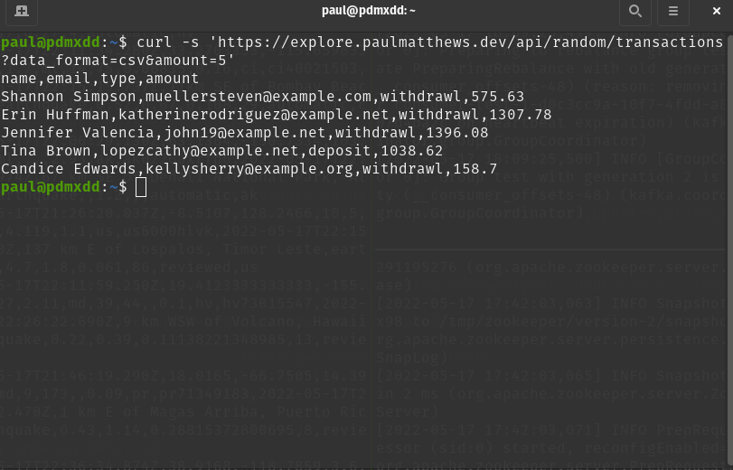

The earthquake project was pretty cool, but it wasn't really a stream.

I want to get experience with a project where data is streaming in and being moved around.

Luckily, I created a Random Data Generator API with Python and FastAPI not too long ago.

{}
I have not yet created a writeup about the Random Data Generator API yet, but it was a fun project that uses Python and FastAPI.
{}

## Data Source

I hosted the Random Data Generator API on my explore blog at https://explore.paulmatthews.dev/api/docs.

The endpoints are configured in a way that allow for the transmission of data via HTTPS in either a JSON or CSV format.

For this project I will be consuming the `/api/random/transactions` endpoint.

I can access a random set of transaction data in a CSV format by making a request like:

```bash
curl -s 'https://explore.paulmatthews.dev/api/random/transactions?data_format=csv&amount=5'
```

Output:



Just a CSV collection of 5 records of randomized transaction data.

## Plan

1. Create 3 Kafka Topics
    1. `transactions`
    1. `deposits`
    1. `withdrawals`
1. Create Kafka Consumer that consumes API at random intervals between 2-5 seconds and uses a KafkaProducer to add transactions to the `transactions` topic.
1. Create a Splitter that will consist of a Kafka Consumer and two Kafka Producers
    1. Kafka Consumer reads from `transactions` topics and loads them as a Case Class
    1. Logic of Consumer determines if transaction is a Deposit or Withdrawal and uses respective Kafka Producers to add it to the appropriate topic

At the end of this journey I will have a more realistic stream, and I should be able to see random data going into the `transactions` topic and then filtering them to the `deposits` and `withdrawals` topics.