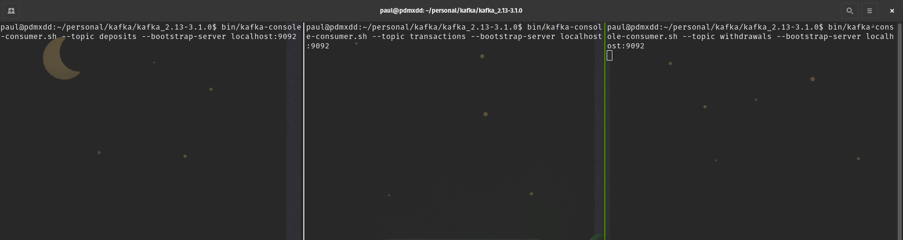

Time for my splitter. Which will be even more complex.

It will need a consumer that reads from `transactions`. Then will load the transactions into a case class. Finally based on the `transactionType` will use one of two Producers to write the content to either the `withdrawals` or `deposits` topics.

## Case Class Transaction

```scala
case class Transaction(name: String, email: String, transactionType: String, amount: Double)
```

I will want to chop up the CSV string and load the data into a Scala case class.

## Get Property Functions

Have to configure Kafka.

```scala
def getConsumerProperties(): Properties = {
    val props: Properties = new Properties()
    props.setProperty(ConsumerConfig.BOOTSTRAP_SERVERS_CONFIG, "localhost:9092")
    props.setProperty(ConsumerConfig.GROUP_ID_CONFIG, "withdrawal-consumer")
    props.setProperty(ConsumerConfig.KEY_DESERIALIZER_CLASS_CONFIG, classOf[StringDeserializer].getName)
    props.setProperty(ConsumerConfig.VALUE_DESERIALIZER_CLASS_CONFIG, classOf[StringDeserializer].getName)
    props
  }

  def getProducerProperties(): Properties = {
    val props: Properties = new Properties()
    props.setProperty(ProducerConfig.BOOTSTRAP_SERVERS_CONFIG, "localhost:9092")
    props.setProperty(ProducerConfig.ACKS_CONFIG, "1")
    props.setProperty(ProducerConfig.KEY_SERIALIZER_CLASS_CONFIG, classOf[StringSerializer].getName)
    props.setProperty(ProducerConfig.VALUE_SERIALIZER_CLASS_CONFIG, classOf[StringSerializer].getName)
    props
  }
```

## Main Method

Again the main method is handling a lot. I'll break it down.

```scala
def main(args: Array[String]): Unit = {
    val consumer: KafkaConsumer[String, String] = new KafkaConsumer[String, String](getConsumerProperties())
    consumer.subscribe(util.Arrays.asList("transactions"))

    val producer: KafkaProducer[String, String] = new KafkaProducer[String, String](getProducerProperties())

    val depositProducer: KafkaProducer[String, String] = new KafkaProducer[String, String](getProducerProperties())

    while(true) {
      val records: ConsumerRecords[String, String] = consumer.poll(Duration.ofMillis(5000))
      records.forEach((record) => {
        val stringTransaction = record.value()
        val listTransaction = stringTransaction.split(",")
        val transaction: Transaction = Transaction(listTransaction(0), listTransaction(1),
          listTransaction(2), listTransaction(3).toDouble)
        if (transaction.transactionType == "withdrawl") {
//          println(transaction)
          val producerRecord: ProducerRecord[String, String] = new ProducerRecord[String, String]("withdrawals",
            f"${transaction.name},${transaction.email},${transaction.transactionType},${transaction.amount}")
          producer.send(producerRecord)
        }
        else {
          val producerRecord: ProducerRecord[String, String] = new ProducerRecord[String, String]("deposits",
            f"${transaction.name},${transaction.email},${transaction.transactionType},${transaction.amount}")
          depositProducer.send(producerRecord)
        }
      })
    }
  }
```

## Consumer

```scala
val consumer: KafkaConsumer[String, String] = new KafkaConsumer[String, String](getConsumerProperties())
    consumer.subscribe(util.Arrays.asList("transactions"))
```

Creating the consumer and subscribing to the topic.

## Producers

```scala
val producer: KafkaProducer[String, String] = new KafkaProducer[String, String](getProducerProperties())

    val depositProducer: KafkaProducer[String, String] = new KafkaProducer[String, String](getProducerProperties())
```

## Infinitely Loop

```scala
while(true) {
      val records: ConsumerRecords[String, String] = consumer.poll(Duration.ofMillis(5000))
```

Every 5 seconds grab all of the records out of the consumer.

## Foreach

```scala
records.forEach((record) => {
        val stringTransaction = record.value()
```

Read each record

## Split CSV String Record into List

```scala
val listTransaction = stringTransaction.split(",") 
```

## Convert to Case Class

```scala
val transaction: Transaction = Transaction(listTransaction(0), listTransaction(1),
          listTransaction(2), listTransaction(3).toDouble)
```

## Determine Transaction Type and Write to Appropriate Topic

```scala
if (transaction.transactionType == "withdrawl") {
          val producerRecord: ProducerRecord[String, String] = new ProducerRecord[String, String]("withdrawals",
            f"${transaction.name},${transaction.email},${transaction.transactionType},${transaction.amount}")
          producer.send(producerRecord)
        }
        else {
          val producerRecord: ProducerRecord[String, String] = new ProducerRecord[String, String]("deposits",
            f"${transaction.name},${transaction.email},${transaction.transactionType},${transaction.amount}")
          depositProducer.send(producerRecord)
        }
```


Let's try this whole thing out.

## Validations

To truly see it working we will need to have both Scala main methods running in their own threads. We will also need to be watching all three topics with data going into them.

This should be fun and good use of `tmux` to watch the fireworks.

Before turning it on, this is what it looks like:



- Deposits in the left screen
- Transactions in the middle screen
- Withdrawals in the right screen

And we're off! 60 second gif of what it looks like:


This project made me feel real good. I think I'm getting a handle of Kafka!