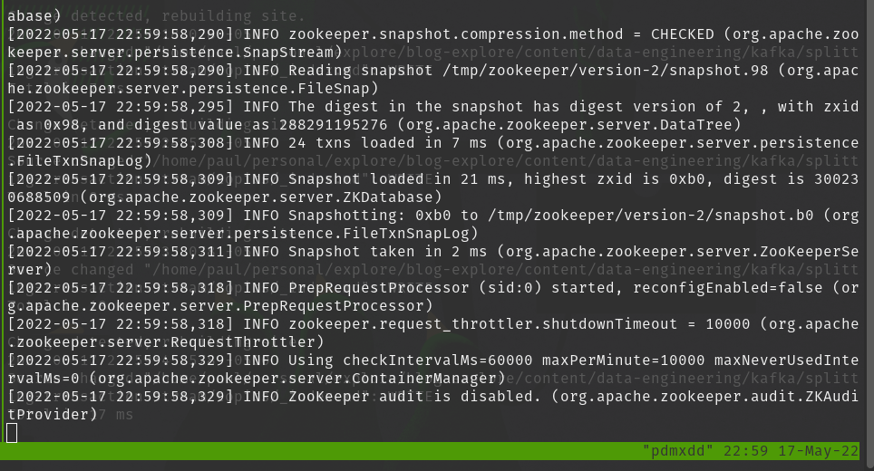
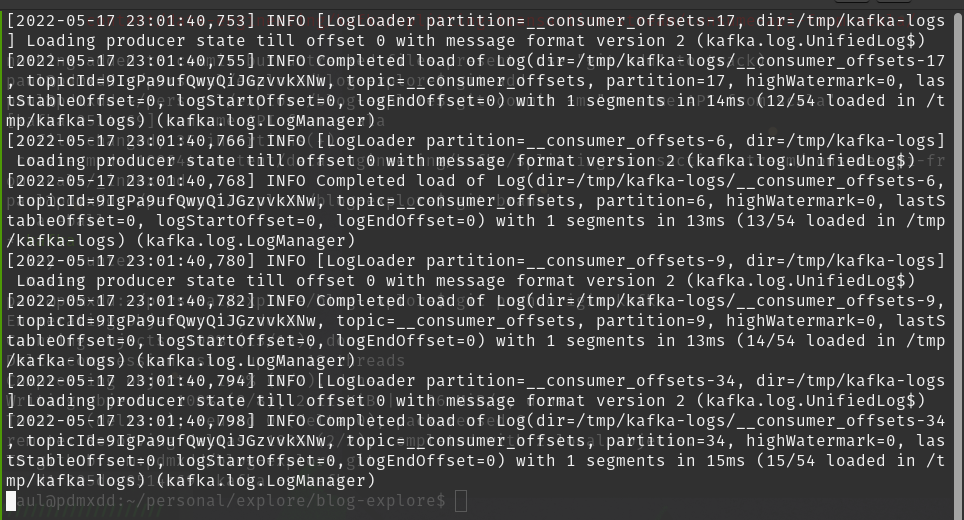
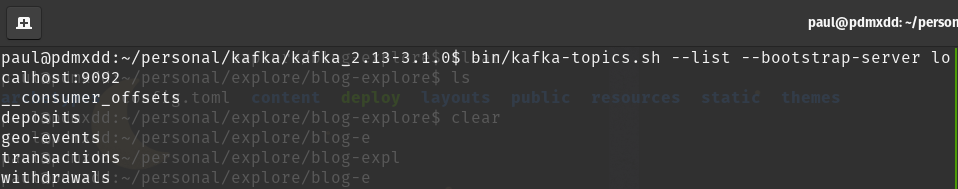

Next up starting the zookeeper service and the kafka server.

Then creating my three topics.

## Zookeeper

```bash
bin/zookeeper-server-start.sh config/zookeeper.properties
```



## Kafka

```bash
bin/kafka-server-start.sh config/server.properties
```



## Transactions Topic

```bash
bin/kafka-topics.sh --create --topic transactions --bootstrap-server localhost:9092
```


## Withdrawals Topics

```bash
bin/kafka-topics.sh --create --topic withdrawals --bootstrap-server localhost:9092
```


## Deposits Topics

```bash
bin/kafka-topics.sh --create --topic deposits --bootstrap-server localhost:9092
```


## Topic Validations

After creating all of the topics I ran:

```bash
bin/kafka-topics.sh --list --bootstrap-server localhost:9092
```

And got the following:



They're all here! As is the geo-events topic I created for my last project. Sadly buddy you won't be seeing any events right now!