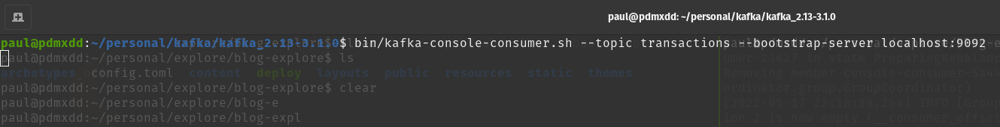
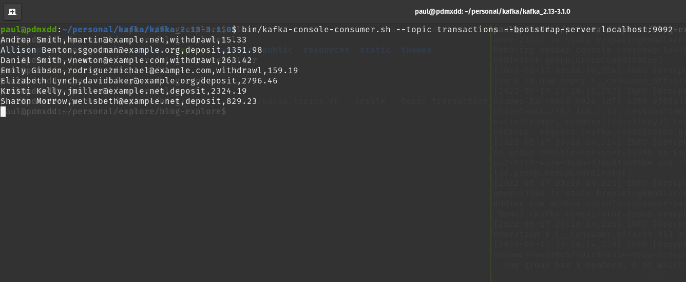

Now that I've got a swanky function to get random sets of CSV transaction data and my Kafka topics. I need to create the producer that will constantly make requests to the API and send the results to the `transactions` topic.

## Code

This will be a little long. I'll break it down one by one.

```scala
object TransactionProducer {

  def getTransactionStringFromAPI(amount: Int): Array[String] = {
    val url = s"https://explore.paulmatthews.dev/api/random/transactions?data_format=csv&amount=$amount"
    val bufferedSource = Source.fromURL(url)
    val stringResponse = bufferedSource.mkString
    bufferedSource.close
    stringResponse.split("\n").drop(1)
  }

  def getProperties: Properties = {
    val properties = new Properties
    properties.setProperty(ProducerConfig.BOOTSTRAP_SERVERS_CONFIG, "localhost:9092")
    properties.setProperty(ProducerConfig.ACKS_CONFIG, "1")
    properties.setProperty(ProducerConfig.KEY_SERIALIZER_CLASS_CONFIG, classOf[StringSerializer].getName)
    properties.setProperty(ProducerConfig.VALUE_SERIALIZER_CLASS_CONFIG, classOf[StringSerializer].getName)

    properties
  }

  def main(args: Array[String]): Unit = {
    // create & configure Producer
    val producer: KafkaProducer[String, String] = new KafkaProducer[String, String](getProperties)
    // infinite loop:
    while (true) {
      // make HTTP request for Transaction data
      val random = Random
      try {
        val transactionArray = getTransactionStringFromAPI(random.nextInt(10))
        // https://explore.paulmatthews.dev/api/random/transactions?amount=(random 1..15)
        // send transaction string CSV to Transaction Topic
        transactionArray.foreach(line => {
          val record: ProducerRecord[String, String] = new ProducerRecord[String, String]("transactions", line)
          producer.send(record)
        })
        // sleep (random 10seconds..45seconds)
        Thread.sleep(random.nextInt(4) * 1000)
      }
      catch  {
        case ioe: java.io.IOException => println("500 error...moving on")
      }

    }
    producer.close()

  }
}
```

### geTransactionStringFromAPI(amount: Int)

I covered this one already. Moving on.

### getProperties(): Properties

This function simply returns the instanced Properties class that is required by the TransactionProducer.

## main()

This is the big one by far.

### Create & Configure Producer

```scala
// create & configure Producer
    val producer: KafkaProducer[String, String] = new KafkaProducer[String, String](getProperties)
```

### Infinite Loop 

```scala
// infinite loop:
    while (true) {
```

### Create Random Object

```scala
val random = Random
```

### Try To Get Data From API

```scala
try {
        val transactionArray = getTransactionStringFromAPI(random.nextInt(10))
```

### Catch any Input Ouput Errors

```scala
catch  {
        case ioe: java.io.IOException => println("500 error...moving on")
      }
```

My Python Fast API we are consuming wasn't really built to handle this many rapid requests and I know it's on a real weak digital ocean droplet. It will fail every once in a while. I don't want the application to exit every time a `500 server error` is returned by the API.

The try/catch will just print out statements for every `500 server error` encountered instead of exiting.

### Foreach Transaction in HTTP Response Send to `transactions` topic

```scala
transactionArray.foreach(line => {
          val record: ProducerRecord[String, String] = new ProducerRecord[String, String]("transactions", line)
          producer.send(record)
        })
```

### Sleep for a few seconds before next request

```scala
Thread.sleep(random.nextInt(4) * 1000)
```

I originally had it set at up to 45 seconds, but really decreased the sleep time so I could see results faster.

### Unreachable producer.close()

```scala
producer.close()
```

The funniest part of this code is the unreachable `producer.close()` I included. It's outside of the `while (true)` loop that contains no `break` statements. So that code will never run.

But it's in my code so it's staying for now.

## Validation

Let's fire up this sucker and see what happens.

```bash
bin/kafka-console-consumer.sh --topic transactions --bootstrap-server localhost:9092
```



After running my application:



It's alive.