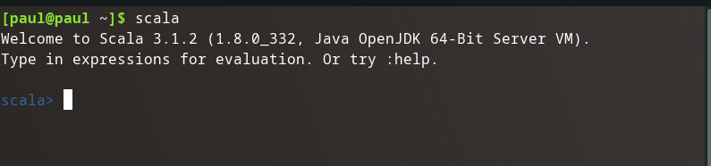

No better place to begin learning a tool other than it's source. In this case from the [Scala Docs](https://docs.scala-lang.org/).

There appear to be many fantastic resources at the main site for Scala Docs. Tour the language, installation instructions, Scala book, collections of books and tutorials, cheat sheets, style guides, full documentation the works really.

Let's get this language on our computer and start using it.

## Installation

[Scala Docs Getting Started](https://docs.scala-lang.org/getting-started/index.html)

Scala recommends installing the [coursier (`cs`) CLI](https://get-coursier.io/docs/cli-installation)

Simple installation instructions for both of my Linux machines (Pop_OS! & Manjaro):

```bash
curl -fL https://github.com/coursier/launchers/raw/master/cs-x86_64-pc-linux.gz | gzip -d > cs
chmod +x cs
./cs setup
```

I modified the `chmod` command to:

```bash
chmod 550 cs
```

Still adds execute for my user and group, but takes write away from everyone, and gives no permissions to others.

## Validation

After `./cs setup` did its thing a few CLI tools were added:

- `cs`
- `scala`
- `scalac`
- `sbt`
- `sbtn`
- `ammonite`
- `scalafmt`

Running a `which` on each results in:

```bash
which cs # ~/.local/share/coursier/bin/cs
which scala # ~/.local/share/coursier/bin/scala
which scalac # ~/.local/share/coursier/bin/scalac
which sbt # ~/.local/share/coursier/bin/sbt
which sbtn # ~/.local/share/coursier/bin/sbtn
which scalafmt # ~/.local/share/coursier/bin/scalafmt
```

`ammonite` is the enhanced REPL that comes with `scala`, so I think I can access it by invoking `scala` from my shell without any arguments:

```bash
scala
```

Output:



Looks like everything is installed.

## Articles

{}