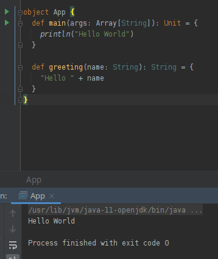

At this point in time I'd normally start exploring the programming fundamentals with the programming language and work through the official resources ([Scala Book](https://docs.scala-lang.org/overviews/scala-book/introduction.html)).

I'm going to try something different and work directly through some of the materials from the bootcamp first and then will go back to the book.

## Setup

I cloned the repo and opened the project in IntelliJ.

IntelliJ prompted me to install the Scala plugin, and to setup a project SDK. Pretty standard IDE stuff.

{}
Upon setting up the SDK on my Pop_OS! machine I selected the wrong version of of Scala SDK and was getting a cryptic error about non matching `ioobe` in the `Statics` class.

It turns out I miss clicked and was using SDK version 2.11.10 instead of 2.12.10. Having some experience with IntelliJ Project Structure I was able to figure it out on my own with some trial and error. However, it was overall not a great experience.
{}

The Project is dictated by a README.md and contains a few challenges

## Challenge #1

```md
## Challenge #1: Make sure you can run the Scala code.

Navigate to App.scala file, and there should be a green arrow next to the main method. Click the green arrow, and click 
run.

What is the output?

Note, if you don't see this green arrow or running the App doesn't work. Check to make sure you have Java installed.
```

Pretty straightforward, just making sure the project is all setup within IntelliJ.

### Validation



Up and running. 

Although I haven't used IntelliJ much lately, it's always been a pleasure to work with.

## Articles

{}