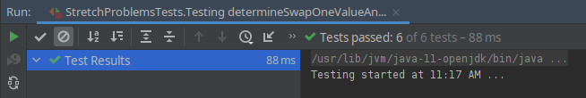
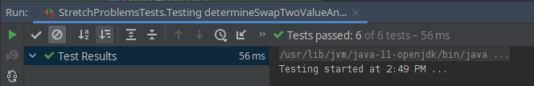
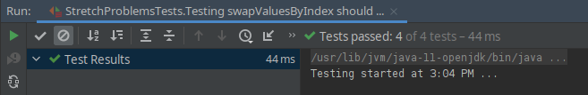
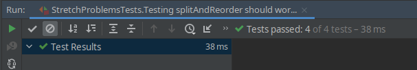
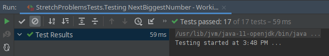

Alright. Time to take another crack at this problem.

After some reflection I really think my logic was sound I just failed in my implementation. The problem has a few parts and I can break it down into smaller pieces and test the individual pieces. I also want to make the problem less complex, by removing the reversal part. I think that was just causing extra confusion.

## Logic

```scala
// Step Zero: covert Int into StringArray

// Step One: determine swap one value and index

// Step Two: determine swap two value and index

// Step Three: make swap

// Step Four: split array on swap position: hold and reOrder

// Step Five: reorder the reOrder array from largest to smallest

// Step Six: rebuild the array & return
```

## Step Zero

No tests necessary because I'm just using built in methods.

### Implementation

```scala
// Step Zero: convert Int into StringArray
val numAsStringArray = theInt.toString.split("")
```

## Step One

### Logic

```scala
// Step One: determine swap one value and index
```

### Tests

```scala
describe("Testing determineSwapOneValueAndIndex") {
    it("should work for 54998") {
      assert(StretchProblems.determineSwapOneValueAndIndex(54998.toString.split("")) === (4, 1))
    }
    it("should work for 45071") {
      assert(StretchProblems.determineSwapOneValueAndIndex(45071.toString.split("")) === (0, 2))
    }
    it("should work for 31233") {
      assert(StretchProblems.determineSwapOneValueAndIndex(31233.toString.split("")) === (2, 2))
    }
    it("should work for 22437") {
      assert(StretchProblems.determineSwapOneValueAndIndex(22437.toString.split("")) === (3, 3))
    }
    it("should work for straightforward examples") {
      assert(StretchProblems.determineSwapOneValueAndIndex(12.toString.split("")) === (1, 0))
      assert(StretchProblems.determineSwapOneValueAndIndex(123.toString.split("")) === (2, 1))
      assert(StretchProblems.determineSwapOneValueAndIndex(67809.toString.split("")) === (0, 3))
    }

    it("should return -1 for straightforward examples") {
      assert(StretchProblems.determineSwapOneValueAndIndex(21.toString.split("")) === (-1, -1))
      assert(StretchProblems.determineSwapOneValueAndIndex(54321.toString.split("")) === (-1, -1))
    }
}
```

### Implementation

```scala
def determineSwapOneValueAndIndex(numStringArray: Array[String]): (Int, Int) = {
    var theValue = -1
    var theIndex = -1
    var i = numStringArray.length - 2
    var notIdentified = true
    while (i >= 0 && notIdentified) {
      if (numStringArray(i + 1).toInt > numStringArray(i).toInt) {
        theValue = numStringArray(i).toInt
        theIndex = i
        notIdentified = false
      }
      i -= 1
    }
    (theValue, theIndex)
}
```

### Result: PASS



## Step Two

This could be combined with the Step One, but I'm trying to hunt down my issue from earlier so I'm going the extra mile. This is something that I would likely refactor later.

### Logic

```scala
// Step Two: determine swap two value and index
```


### Tests

```scala
describe("Testing determineSwapTwoValueAndIndex") {
    it("should work for 54998") {
      assert(StretchProblems.determineSwapTwoValueAndIndex(54998.toString.split("")) === (8, 4))
    }
    it("should work for 45071") {
      assert(StretchProblems.determineSwapTwoValueAndIndex(45071.toString.split("")) === (1, 4))
    }
    it("should work for 31233") {
      assert(StretchProblems.determineSwapTwoValueAndIndex(31233.toString.split("")) === (3, 3))
    }
    it("should work for 22437") {
      assert(StretchProblems.determineSwapTwoValueAndIndex(22437.toString.split("")) === (7, 4))
    }
    it("should work for straightforward examples") {
      assert(StretchProblems.determineSwapTwoValueAndIndex(12.toString.split("")) === (2, 1))
      assert(StretchProblems.determineSwapTwoValueAndIndex(123.toString.split("")) === (3, 2))
      assert(StretchProblems.determineSwapTwoValueAndIndex(67809.toString.split("")) === (9, 4))
    }

    it("should return -1 for straightforward examples") {
      assert(StretchProblems.determineSwapOneValueAndIndex(21.toString.split("")) === (-1, -1))
      assert(StretchProblems.determineSwapOneValueAndIndex(54321.toString.split("")) === (-1, -1))
    }
}
```

### Implementation

```scala
def determineSwapTwoValueAndIndex(numStringArray: Array[String]): (Int, Int) = {
    // find initial swap two value and index
    var swapOneValue = -1
    var swapOneIndex = -1
    var theValue = -1
    var theIndex = -1
    var i = numStringArray.length - 2
    var notIdentified = true
    while (i >= 0 && notIdentified) {
      if (numStringArray(i + 1).toInt > numStringArray(i).toInt) {
        theValue = numStringArray(i + 1).toInt
        theIndex = i + 1
        swapOneValue = numStringArray(i).toInt
        swapOneIndex = i
        notIdentified = false
      }
      i -= 1
    }
    if (theIndex == -1) {
      return (-1, -1)
    }
    // check that there aren't any better swap two candidates in the numbers after swapTwo position
    i = theIndex;
    while (i < numStringArray.length) {
      if(numStringArray(i).toInt > swapOneValue && numStringArray(i).toInt < theValue) {
        theValue = numStringArray(i).toInt
        theIndex = i
      }
      i += 1
    }
    (theValue, theIndex)
  }
```

After working on the implementation I realized that I couldn't perform the check for a better swap two candidate, without also knowing the swap one value...

This caused me to essentially duplicate the the solution for Step One I performed earlier. Again showing that these should be collapsed into one solution, but before any refactoring can happen. I need ot make sure the implementation passes the tests.

### Result: PASS



I will refactor. But let's keep moving forward for now.

## Step Three

### Logic

```scala
// Step Three: make swap
```


### Tests

```scala
describe("Testing swapValuesByIndex") {
    it("should work for 54998") {
      assert(StretchProblems.swapValuesByIndex(1, 4, 54998.toString.split("")) === 58994.toString.split(""))
    }
    it("should work for 45071") {
      assert(StretchProblems.swapValuesByIndex(2, 4, 45071.toString.split("")) === 45170.toString.split(""))
    }
    it("should work for 31233") {
      assert(StretchProblems.swapValuesByIndex(2, 3, 31233.toString.split("")) === 31323.toString.split(""))
    }
    it("should work for 22437") {
      assert(StretchProblems.swapValuesByIndex(4, 3, 22437.toString.split("")) === 22473.toString.split(""))
    }
}
```

### Implementation

```scala
def swapValuesByIndex(indexOne: Int, indexTwo: Int, numStringArray: Array[String]): Array[String] = {
    val tempVal = numStringArray(indexOne)
    numStringArray(indexOne) = numStringArray(indexTwo)
    numStringArray(indexTwo) = tempVal
    numStringArray
}
```

### Result: PASS



## Step Four

### Logic

```scala
// Step Four: split array on swap position: hold and reOrder
```

### Tests

```scala
describe("Testing splitAndReorder") {
    it("should work for 54998") {
      assert(StretchProblems.splitAndReorder(1, 58994.toString.split("")) === 58499.toString.split(""))
    }
    it("should work for 45071") {
      assert(StretchProblems.splitAndReorder(2, 45170.toString.split("")) === 45107.toString.split(""))
    }
    it("should work for 31233") {
      assert(StretchProblems.splitAndReorder(2, 31323.toString.split("")) === 31323.toString.split(""))
    }
    it("should work for 22437") {
      assert(StretchProblems.splitAndReorder(4, 22473.toString.split("")) === 22473.toString.split(""))
    }
}
```

### Implementation

```scala
def splitAndReorder(indexOne: Int, numStringArray: Array[String]): Array[String] = {
    val (hold, reorder) = numStringArray.splitAt(indexOne + 1)
    val reordered = reorder.sorted
    hold ++ reordered
}
```

{}
Without checking the documentation I made an assumption about `.splitAt()` thinking it would split inclusively on the first group. Turns out is splits inclusively on the second group. So simply adding 1 to the parameter fixed the issue. Confirmed by the [Scala Docs](https://docs.scala-lang.org/overviews/collections-2.13/trait-iterable.html#inner-main)
{}

### Result: PASS



## Step Five

Accomplished by previous step.

## Step Six

Accomplished by previous step.

## Bringing it together 

I should be able to put all the pieces together in the original method and run it against the tests.

### Implementation

```scala
def getNextBiggestNumber(theInt: Integer): Int = {
    // I think breaking the problem down into smaller functions (that are tested) will help tremendously

    // Step Zero: covert Int into StringArray
    val numAsStringArray = theInt.toString.split("")
    
    // Step One: determine swap one value and index
    val (swapOneValue, swapOneIndex) = determineSwapOneValueAndIndex(numAsStringArray)

    // return -1 if no swap candidate found
    if (swapOneIndex == -1) {
      return -1
    }

    // Step Two: determine swap two value and index
    val (swapTwoValue, swapTwoIndex) = determineSwapTwoValueAndIndex(numAsStringArray)
    
    // Step Three: make swap
    val newArray = swapValuesByIndex(swapOneIndex, swapTwoIndex, numAsStringArray)

    // Step Four: split array on swap position: hold and reOrder
    val finalArray = splitAndReorder(swapOneIndex, numAsStringArray)
    
    // Rebuild the array & return
    finalArray.mkString.toInt
}
```

### Results: PASS

Finally!



The solution is a little messy. I'd like to combine `determineSwapOneValueAndIndex()` and `determineSwapTwoValueAndIndex()` to reduce the duplication and remove the never used variable `swapOneValue`, but overall I'm happy with the solution.

I'll refactor at a later date.