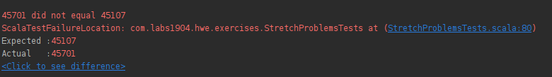
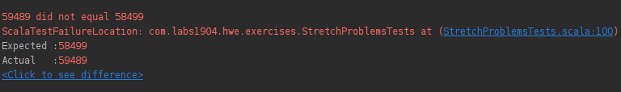

```md
## Challenge #5: Complete Stretch Problems

Complete stretch problems and ensure all tests pass. 
```

## Stretch Problems

We've got two problems here:

```scala
  /*
  Checks if a string is palindrome.
 */
  def isPalindrome(s: String): Boolean = ???

  /*
For a given number, return the next largest number that can be created by rearranging that number's digits.
If no larger number can be created, return -1
 */
  def getNextBiggestNumber(i: Integer): Int = {
    //TODO: Implement me!
    0
  }
```

Check if a string is a palindrome and a rearrange the digits in a number to determine the next largest number.

Fun problems.

Let's get to it.

## `isPalindrome()`

### Tests

```scala
  describe("isPalindrome - Working with Strings"){
    it("Returns true if a word is spelled the same forward and backward"){
      val input = "hannah"
      val expected = true

      val actual = StretchProblems.isPalindrome(input)

      assert(actual === expected)
    }

    it("Returns false if a word is not spelled the same forward and backward"){
      val input = "Hello"
      val expected = false

      val actual = StretchProblems.isPalindrome(input)

      assert(actual === expected)
    }
  }
```

### My Solution

```scala
  def isPalindrome(s: String): Boolean = {
    val (begin, end) = s.splitAt((s.length / 2).toInt)
    begin == end.reverse
  }
```

So this passes the two tests, but would fail for a new test of the word `racecar`.

If you look at my solution and the two test cases it does the following:

Takes `hannah` and splits it into `begin=han` and `end=nah` then returns `begin == end.reverse` (`han == han`).

Takes `Hello` and splits it into `begin=He` and `end=llo` then returns `begin == end.reverse` (`He == oll`). Since there is an odd number of letters in the word it's impossible for my comparison to determine if the word is a palindrome.

I essentially want to lop of the middle letter so I do have two strings with equal lengths before reversing one and comparing.

Let's add a new test.

### New Test

```scala
    it("Returns true for 'racecar'") {
      val input = "racecar"
      val expected = true

      val actual = StretchProblems.isPalindrome(input)

      assert(actual === expected)
    }
```

Upon rerunning the new test fails. Time to refactor my solution.

### Refactor

```scala
  def isPalindrome(s: String): Boolean = {
    var (begin, end) = s.splitAt((s.length / 2).toInt)
    if (begin.length != end.length) {
      end = end.substring(1)
    }
    begin == end.reverse
  }
```

If there is a length mismatch just lop off the first character of the `end` string.

### Result: PASS

## `getNextBiggestNumber()`

### Sample Tests

There are few tests so I'll just provide a couple of them here.

```scala
describe("Testing NextBiggestNumber - Working with numbers, strings, and lists") {
    it("should return the next biggest number for straightforward examples") {
      assert(StretchProblems.getNextBiggestNumber(12) === 21)
      assert(StretchProblems.getNextBiggestNumber(123) === 132)
      assert(StretchProblems.getNextBiggestNumber(67809) === 67890)
    }

    it("should return -1 for straightforward examples") {
      assert(StretchProblems.getNextBiggestNumber(21) === -1)
      assert(StretchProblems.getNextBiggestNumber(54321) === -1)
    }

    it("should work for 52210") {
      assert(StretchProblems.getNextBiggestNumber(52210) === -1)
    }

    it("should work for 95701") {
      assert(StretchProblems.getNextBiggestNumber(95701) === 95710)
    }
    // ...trimmed
}
```

### Initial Psuedo-Algorithm

Just looking at this I think I've got an algorithm.

Take any number and move from right to left. If the number on the right is bigger than the number on the left you can swap their positions and have the next largest number.

Let's try it out.

`123`: the `3` is larger than the `2` so if you swap them you should have the next largest number `132`.

All of the possibilities for `123`:

- `123`
- `132`
- `213`
- `231`
- `312`
- `321`

And again.

`27884921`. The `9` is the first number that's larger than the number to its left.

So `27889421` should be the next largest possible number?

What are the numbers near it:

- `27884921`: original
- `27889421`: my algorithm solution
- `27889241`: another possibility that is smaller
- `27889214`: even smaller
- `27889142`: even smaller
- `27889124`: finally the smallest

This time it fails. It looks like there's another step. In that if the number that was identified in part one is matched if there are any remaining numbers to the right they need to be placed from smallest to largest after the swap occurs.

Taking the same example with our slight modification.

`27884921`. The `9` is the first number that's larger than the number to its left (`4`). **Swap their positions**

`27889` and `421` of the `421` put them in ascending order: `124` and affix them to the first number to get `27889124`. This is the smallest number.

I think this is solid enough to code and run against the tests.

### My Solution

```scala
  def getNextBiggestNumber(theInt: Integer): Int = {
    // part one identify and swap candidates if they exist
    val numAsStringArray = theInt.toString.split("").reverse
    var i = 0;
    var stop = true
    var swapPosition = -1
    while (i < numAsStringArray.length - 1 && stop) {
      if (numAsStringArray(i).toInt > numAsStringArray(i+1).toInt) {
        val temp = numAsStringArray(i+1)
        numAsStringArray(i+1) = numAsStringArray(i)
        numAsStringArray(i) = temp
        stop = false
        swapPosition = i + 1
      }
      i+=1
    }
    if (stop) return -1

    // wherever the swap happened all of the remaining numbers need to be put in smallest to largest order
    var first = numAsStringArray.slice(0, swapPosition)
    val second = numAsStringArray.slice(swapPosition, numAsStringArray.length)
    val first_sorted = first.sorted.reverse
    val recombined = first_sorted ++ second
    val recombined_number = recombined.reverse.mkString.toInt

    recombined_number
  }
```

This one was a tough one. It's a pretty ugly solution, but let's see how it does.

### Result: FAIL

Well two of 17 failed.

So I'm close, but not quite on the money.

I might have to rethink the solution.

### Investigation

#### Failed test one:

```scala
    it("should work for 45071") {
      assert(StretchProblems.getNextBiggestNumber(45071) === 45107)
    }
```

My algorithm:

`45071`

- `7` is larger than `0` swap them to `45701`
- starting at `01` sort them from smallest to largest `01`
- final: `45701`



#### Failed test two:

```scala
    it("should work for 54998") {
      assert(StretchProblems.getNextBiggestNumber(54998) === 58499)
    }
```

My algorithm:

`54998`

- `9` is larger than `4` swap them to `59498`
- starting at `498` sort them from smallest to largest `489`
- final: `59489`



So my algorithm is working the way I built it. So the error was with my logic, not with my implementation!

In looking at my logic, I think I made an error. I shouldn't swap the two numbers when I find a match, I need to first determine if any other numbers are larger than number, but smaller than the neighbor.

`54998`

- `9` is bigger than `4`
- check all numbers to the right of `9` to see if any numbers are smaller than `9` but greater than `4`:
  - `8` found
- swap `4` with `8`: `58994`
- reorder all numbers after swapped digit one, from smallest to largest:
  - `58499` **this is the right answer**

So before I make the swap between the numbers, we need to first determine if there is a better swap candidate, and then reorder.

### New Solution

```scala
def getNextBiggestNumber(theInt: Integer): Int = {
    
    // reverse array
    
    // determine swap target one index and value from left to right
    
    // determine swap target two index and value of remaining values to the right of swap target one index
    
    // make swap
    
    // split into two at swap target one index
    
    // order from largest to smallest in group one
    
    // rebuild all the pieces and return
    
  }
```

```scala
  def getNextBiggestNumber(theInt: Integer): Int = {

    // reverse array
    val numAsStringArray = theInt.toString.split("").reverse
    // determine swap target one index and value from left to right
    var i = 0;
    var swapTargetOneIndex = -1
    var swapTargetOneValue = -1
    var swapTargetTwoIndex = -1
    var swapTargetTwoValue = -1
    var notIdentified = true;
    while (i < numAsStringArray.length - 1 && notIdentified) {
      if (numAsStringArray(i).toInt > numAsStringArray(i + 1).toInt) {
        swapTargetOneIndex = i
        swapTargetOneValue = numAsStringArray(i).toInt
        notIdentified = false
        swapTargetTwoIndex = i + 1;
        swapTargetTwoValue = numAsStringArray(i+1).toInt
      }
      i += 1
    }
    if (swapTargetOneIndex == -1) {
      return -1
    }
    // determine swap target two index and value of remaining values to the right of swap target one index
    while (i < numAsStringArray.length - 1) {
      if (numAsStringArray(i).toInt > swapTargetOneValue && numAsStringArray(i).toInt < swapTargetTwoValue ) {
        swapTargetTwoValue = numAsStringArray(i).toInt
        swapTargetTwoIndex = i
      }
      i += 1
    }
    // make swap
    numAsStringArray(swapTargetOneIndex) = swapTargetTwoValue.toString
    numAsStringArray(swapTargetTwoIndex) = swapTargetOneValue.toString
    // split into two at swap target one index
    var first = numAsStringArray.slice(0, swapTargetOneIndex)
    val second = numAsStringArray.slice(swapTargetOneIndex, numAsStringArray.length)
    // order from largest to smallest in group one
    val first_sorted = first.sorted.reverse
    // rebuild all the pieces and return
    val recombined = first_sorted ++ second
    val recombined_number = recombined.reverse.mkString.toInt
    recombined_number
  }
```

### Result: FAIL

4 tests failed. After debugging through one of the failed tests I found that I was splitting in the wrong spot. Instead of splicing on `SwapTargetOneIndex`, I needed to splice on `SwapTargetTwoIndex` because I had reversed the array.

### Refactor

```scala
  def getNextBiggestNumber(theInt: Integer): Int = {

    // reverse array
    val numAsStringArray = theInt.toString.split("").reverse
    // determine swap target one index and value from left to right
    var i = 0;
    var swapTargetOneIndex = -1
    var swapTargetOneValue = -1
    var swapTargetTwoIndex = -1
    var swapTargetTwoValue = -1
    var notIdentified = true;
    while (i < numAsStringArray.length - 1 && notIdentified) {
      if (numAsStringArray(i).toInt > numAsStringArray(i + 1).toInt) {
        swapTargetOneIndex = i
        swapTargetOneValue = numAsStringArray(i).toInt
        notIdentified = false
        swapTargetTwoIndex = i + 1;
        swapTargetTwoValue = numAsStringArray(i+1).toInt
      }
      i += 1
    }
    if (swapTargetOneIndex == -1) {
      return -1
    }
    // determine swap target two index and value of remaining values to the right of swap target one index
    while (i < numAsStringArray.length - 1) {
      if (numAsStringArray(i).toInt > swapTargetOneValue && numAsStringArray(i).toInt < swapTargetTwoValue ) {
        swapTargetTwoValue = numAsStringArray(i).toInt
        swapTargetTwoIndex = i
      }
      i += 1
    }
    // make swap
    numAsStringArray(swapTargetOneIndex) = swapTargetTwoValue.toString
    numAsStringArray(swapTargetTwoIndex) = swapTargetOneValue.toString
    // split into two at swap target one index
    var first = numAsStringArray.slice(0, swapTargetTwoIndex)
    val second = numAsStringArray.slice(swapTargetTwoIndex, numAsStringArray.length)
    // order from largest to smallest in group one
    val first_sorted = first.sorted.reverse
    // rebuild all the pieces and return
    val recombined = first_sorted ++ second
    val recombined_number = recombined.reverse.mkString.toInt
    recombined_number
  }
```

### Result: FAIL

2 tests failed. Progress. But I have to stop. It's been about 2.5 hours total of banging my head against this problem.

I've made progress, but for me to move past this problem I should:

- rest
- research potential solutions to the problem
  - talk to another developer
  - search the internet for similar problems (this is a good test problem so I'm sure there are plenty of solutions out there)
- move onto a new problem and loop back to this after gaining more experience with scala

So I'm leaving this challenge in a frustrating spot. I got it very close to the finish line, but couldn't quite get it there on my own in a two hour time period. **That's ok! I'll take a break, work through the steps I outlined above and get back to it later.**