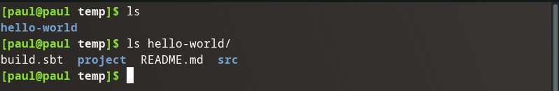
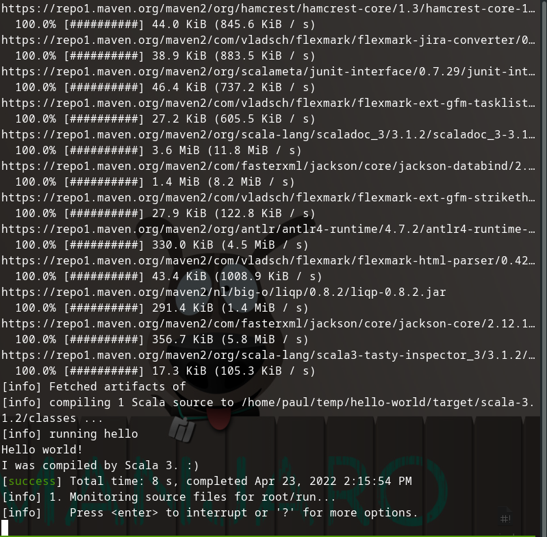
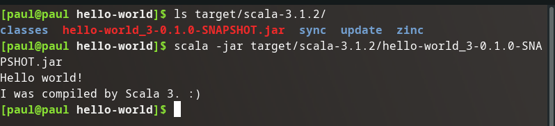

Following the Scala Docs [Getting Started]() page next up is creating the eponymous `Hello, World!` project with `sbt` the scala build tool.

## Create Project

The instructions from the site are straightforward:

```bash
sbt new scala/scala3.g8
```

Then enter the project name: `hello-world`.

## Explore Project

### File Structure

Looks like it worked:



### Main

Additionally it created an entry point for the application in `src/main/scala/Main.scala`:

```scala
@main def hello: Unit = 
  println("Hello world!")
  println(msg)

def msg = "I was complied by Scala 3. :)"
```

## Run Project

Looks like I can run it with my terminal using the `sbt ~run` command.



Well `sbt` is living up to its name `Scala Build Tool`. Upon running the project at project root, it scanned the project, downloaded any necessary dependencies, and ran the project. 

Upon looking at some changes made to the project directory I think it compiled and built a `.jar` file we can probably execute directly.



Thanks brain for holding onto all that Java knowledge, it's coming in handy!