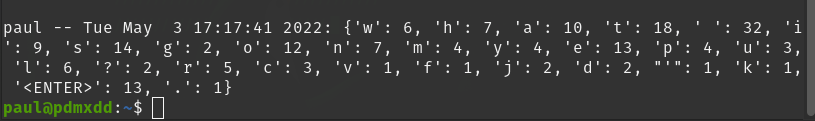

This was a pretty easy conversion.

I simply added a function and updated the main method.

## New Function

```python
def convert_log_to_dict(some_log):
    the_dict = {}
    for letter in some_log:
        if letter in the_dict.keys():
            the_dict[letter] += 1
        else:
            the_dict[letter] = 1
    return the_dict
```

Since we already have a list with all of the characters as elements we can easily just convert that list to a dictionary with the characters as the keys. We can then just increment the key count by one for each time the key is re-encountered.

## Updated Main

In the main method we just need to pass the existing key-log to the conversion to dict function and print the output of the dictionary.

```python
log_line = f"{getlogin()} -- {asctime(localtime())}: {convert_log_to_dict(log)}"
```

## Results

After running the changed file you can now see the order of the keystrokes have been **obfuscated**.

We know which keys were pressed, but without their order we aren't harvesting unethical data.



## Source Code Snapshot

New file called `counter.py` added where I copied in the original file and made the changes.

[GitHub repo at this point in time](https://github.com/pdmxdd/pylogger/blob/097511a75b9aa5e3abf4ee94a6f52f5e412dc996/pylogger/counter.py)


This would be a much more appropriate project for a group of learners.