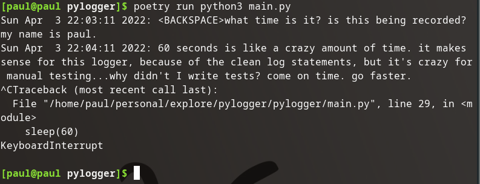
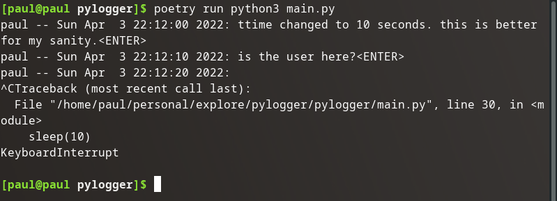

## Better Print Statement

I'd like each print statement to look more like a log, so the timestamp and user would be a great addition to each new line.

## Timestamp

### Imports

```python
from time import sleep, asctime, localtime
```

### Print update

```python
print(f"{asctime(localtime())}: {''.join(log)}")
```

### Validation



## User

### Imports

```python
from os import getlogin
```

### Print update

```python
print(f"{getlogin()} -- {asctime(localtime())}: {''.join(log)}")
```

### Validation



Even better.

## Source Code Snapshot

[GitHub repo at this point in time](https://github.com/pdmxdd/pylogger/tree/211f75c76d9460b2240ec305292ae024a633de00)