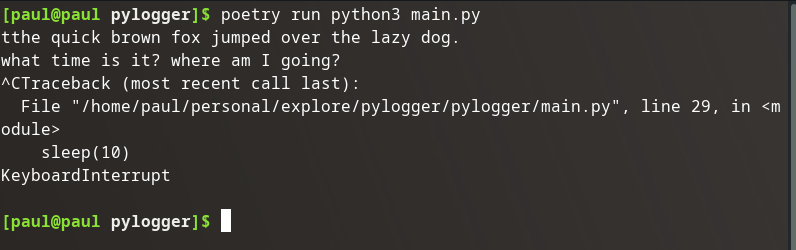

## Infinitely Loop

Let's infinitely loop in the main method:

```python
if __name__ == "__main__":
    while True:
        log = []
        listener = keyboard.Listener(on_press=on_press)
        listener.start()
        sleep(60)
        listener.stop()
        print("".join(log))
```

### Validation



The logger only stops when the process initiated by the script is sent an interrupt signal (`ctrl+c`).

### Source Code Snapshot

[GitHub repo at this point in time](https://github.com/pdmxdd/pylogger/blob/885669174a8051710b32e707a7b16826b4b421eb/pylogger/main.py)