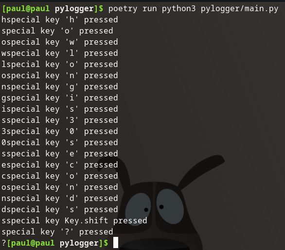
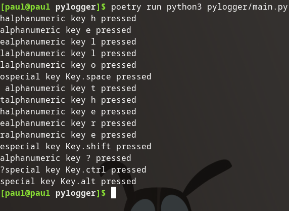

## Add main

I want to put the actual logic of this script in a python3 main method. I'm only interested in the non-blocking fashion, so I will remove the unnecessary option.

Remove:

```python
# Collect events until released
with keyboard.Listener(on_press=on_press, on_release=on_release) as listener:
    listener.join()
```

Since the program isn't blocked I will need to have the program `sleep()` for a few seconds to actively monitor the keyboard, and then it will automatically stop the listener. 

I will need to add an import for the `sleep()` method from the `time` package:

```python
from time import sleep
```

Finally I will move the non-blocking option into the main method, start the listener, sleep for a few seconds, and then stop the listener:

```python
# ...or, in a non-blocking fashion:
if __name__ == "__main__":
    listener = keyboard.Listener(on_press=on_press, on_release=on_release)
    listener.start()
    sleep(30)
    listener.stop()
```

Then give it a run:


The script stops the listener and exits after one period of 30 second monitoring.

### Source Code Snapshot

[GitHub repo at this point in time](https://github.com/pdmxdd/pylogger/blob/1449a2c3f4d2fc4bb49dcffb554a9dbe277feecd/pylogger/main.py)

## Remove `on_release()`

I don't like that it is printing out statements on key release. I also don't need the listener to exit when the user releases the `esc` key.

Remove:

```python
def on_release(key):
    print('{0} released'.format(key))
    if key == keyboard.Key.esc:
        # Stop listener
        return False
```

Also remove the `on_release=on_release` from the listener constructor.

Then give it a run:



Alright, it's no longer doubling up our prints!

### Source Code Snapshot

[GitHub repo at this point in time](https://github.com/pdmxdd/pylogger/blob/9efe1ca56eb65be5099bf6009d52ddc5a617894c/pylogger/main.py)

## Fix Typo

If you look at STDOUT it is always displaying `special key`, which is odd. For the alphanumeric characters it's supposed to print out `alphanumeric`. We have our first bug.

Let's take a look at the section of our code responsible for printing the `on_press` function:

```python
def on_press(key):
    try:
        print('alphanumeric key {0} pressed'.format(key.car))
    except AttributeError:
        print('special key {0} pressed'.format(key))
```

I **highly doubt** the key object has a `.car` attribute. However, it probably has a `.char` attribute.

Let's fix that error and re-run the project.



Nice.

## Modify `on_press()`

The provided on_press() function is a great start. However, I don't want to track **all** key presses as many of the keys don't really matter to me, like the function keys, ctrl, alt, and d-pad.

I'm really interested in the following data:

- typed words (`alphanumeric`)
- typed numbers (`alphanumeric`)
- space bar (special: `Key.space`)
- tab (special: `Key.tab`)
- enter (special: `Key.enter`)
- backspace (special: `Key.backspace`)
- delete (special: `Key.delete`)

### Print only `alphanumeric`

### Also `Key.space` as `" "`

### Also `Key.tab` as `" "`

### Also `Key.enter` as `"<ENTER>"`

### Also `Key.delete` as `"<DELETE>"`

## `Key.backspace` Removes Last List Item

## Infinitely Loop