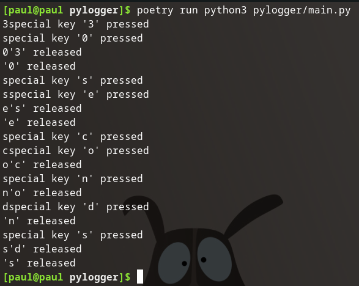

## Add main

I want to put the actual logic of this script in a python3 main method. I'm only interested in the non-blocking fashion, so I will remove the unnecessary option.

Remove:

```python
# Collect events until released
with keyboard.Listener(on_press=on_press, on_release=on_release) as listener:
    listener.join()
```

Since the program isn't blocked I will need to have the program `sleep()` for a few seconds to actively monitor the keyboard, and then it will automatically stop the listener. 

I will need to add an import for the `sleep()` method from the `time` package:

```python
from time import sleep
```

Finally I will move the non-blocking option into the main method, start the listener, sleep for a few seconds, and then stop the listener:

```python
# ...or, in a non-blocking fashion:
if __name__ == "__main__":
    listener = keyboard.Listener(on_press=on_press, on_release=on_release)
    listener.start()
    sleep(30)
    listener.stop()
```

Then give it a run:



The script stops the listener and exits after one period of 30 second monitoring.

### Source Code Snapshot

[GitHub repo at this point in time](https://github.com/pdmxdd/pylogger/blob/1449a2c3f4d2fc4bb49dcffb554a9dbe277feecd/pylogger/main.py)

## Remove `on_release()`

## Only Print after Interval

## Modify `on_press()`

## Infinitely Loop