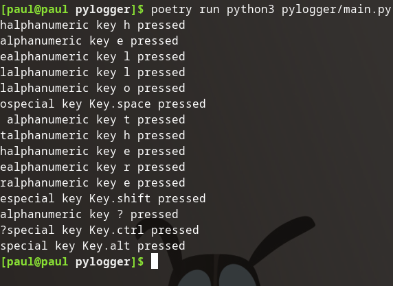

## Fix Typo

If you look at STDOUT it is always displaying `special key`, which is odd. For the alphanumeric characters it's supposed to print out `alphanumeric`. We have our first bug.

Let's take a look at the section of our code responsible for printing the `on_press` function:

```python
def on_press(key):
    try:
        print('alphanumeric key {0} pressed'.format(key.car))
    except AttributeError:
        print('special key {0} pressed'.format(key))
```

I **highly doubt** the key object has a `.car` attribute. However, it probably has a `.char` attribute.

Let's fix that error and re-run the project.



Nice.

### Source Code Snapshot

[GitHub repo at this point in time](https://github.com/pdmxdd/pylogger/tree/77e1eaa42e0b8b2374b539edd391cde4542edd01https://github.com/pdmxdd/pylogger/blob/77e1eaa42e0b8b2374b539edd391cde4542edd01/pylogger/main.py)