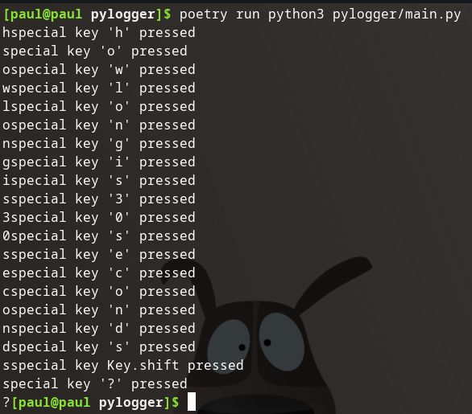

## Remove `on_release()`

I don't like that it is printing out statements on key release. I also don't need the listener to exit when the user releases the `esc` key.

Remove:

```python
def on_release(key):
    print('{0} released'.format(key))
    if key == keyboard.Key.esc:
        # Stop listener
        return False
```

Also remove the `on_release=on_release` from the listener constructor.

Then give it a run:



Alright, it's no longer doubling up our prints!

### Source Code Snapshot

[GitHub repo at this point in time](https://github.com/pdmxdd/pylogger/blob/9efe1ca56eb65be5099bf6009d52ddc5a617894c/pylogger/main.py)