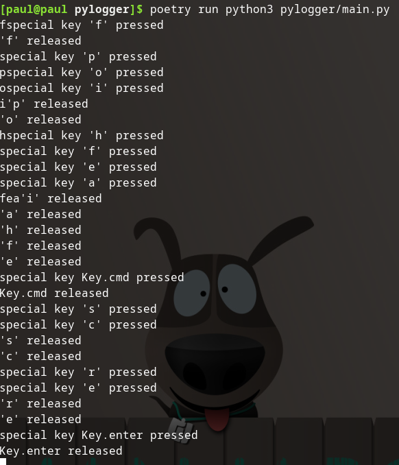

## Pynput

The Pynput documentation provides a [keyboard monitoring example](https://pynput.readthedocs.io/en/latest/keyboard.html#monitoring-the-keyboard):

```python
from pynput import keyboard

def on_press(key):
    try:
        print('alphanumeric key {0} pressed'.format(
            key.char))
    except AttributeError:
        print('special key {0} pressed'.format(
            key))

def on_release(key):
    print('{0} released'.format(
        key))
    if key == keyboard.Key.esc:
        # Stop listener
        return False

# Collect events until released
with keyboard.Listener(
        on_press=on_press,
        on_release=on_release) as listener:
    listener.join()

# ...or, in a non-blocking fashion:
listener = keyboard.Listener(
    on_press=on_press,
    on_release=on_release)
listener.start()
```

Let's pop it `main.py` and give it a run:



It's alive!

## Source Code

[GitHub Repo at this point in time](https://github.com/pdmxdd/pylogger/tree/aca230ad278d03fb07010836ea8abbc6fa0b31e4) code added in `pylogger/main.py`.

## Next Steps

The example runs without issue, but it's not exactly code I would use. I'll need to modify it to meet my specific needs.