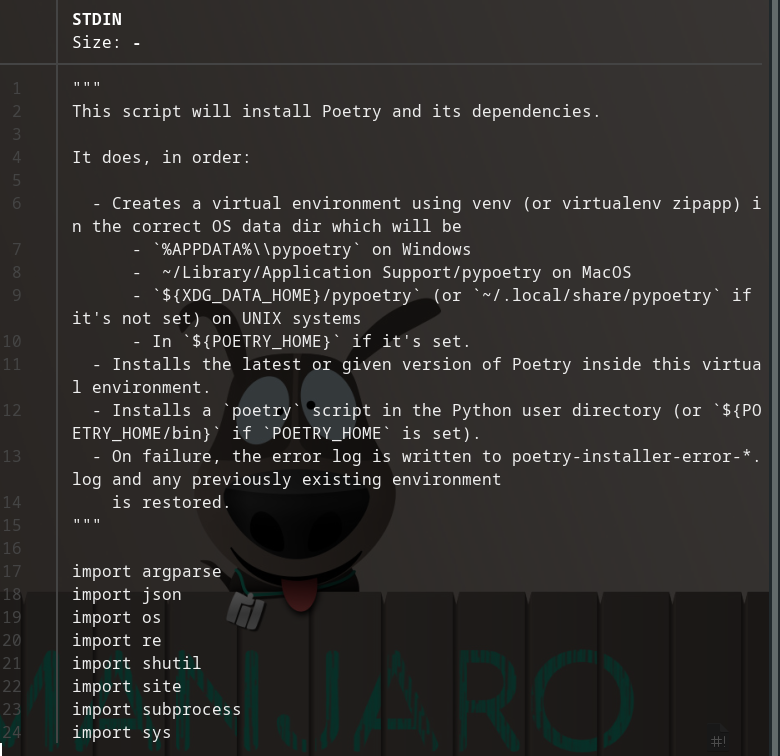
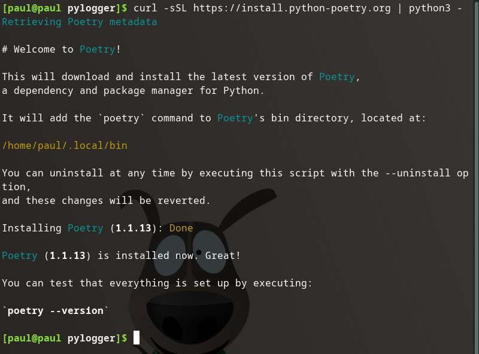
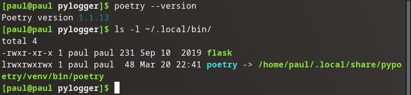
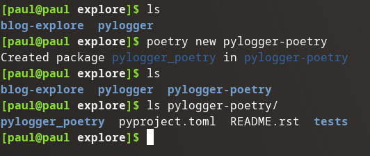
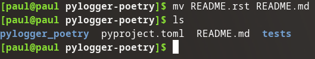
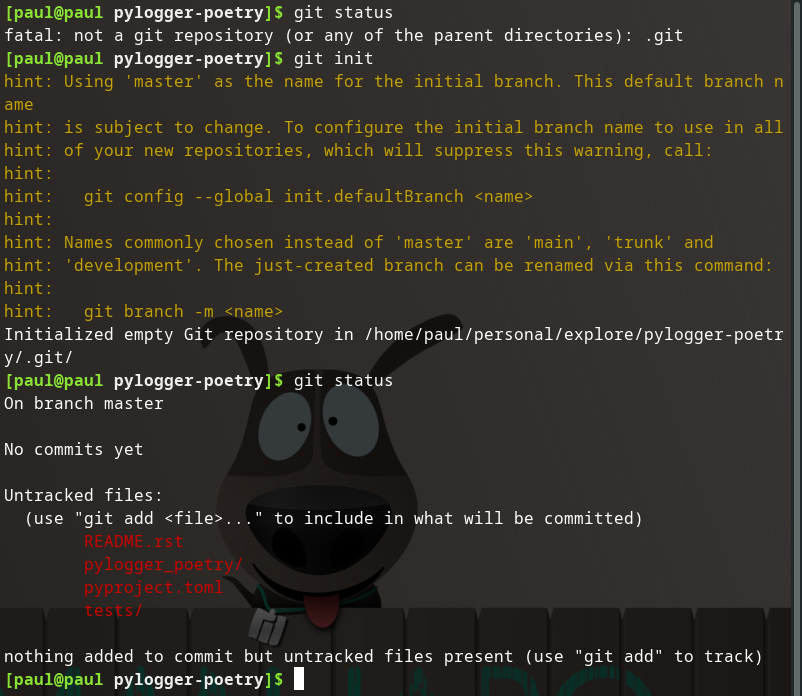
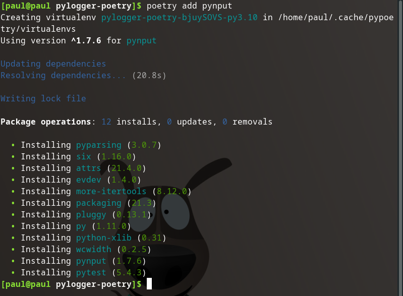
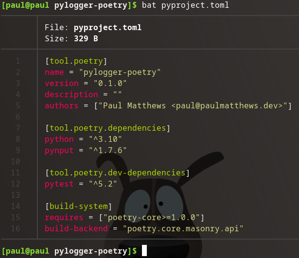

## Poetry Documentation

When you are working with a new tool there is no bette resource than the official documentation. If I'm dealing with an open source tool I like to view both the remote git repo (like GitHub, GitLab, or BitBucket) and the official docs.

### Poetry Resources

- [Poetry GitHub Repo](https://github.com/python-poetry/poetry)
- [Poetry Official Documentation](https://python-poetry.org/docs/)
- [Poetry Website Homepage](https://python-poetry.org/)

## Installation

The GH repository provides a simple command for unix based systems:

```bash
curl -sSL https://install.python-poetry.org | python3 -
```

### Breakdown

`curl -sSL https://install.python-poetry.org`: a simple curl request for whatever is served at https://install.python-poetry.org.

- `-s`: silent mode
- `-S`: show error (`--show-error`)
- `-L`: location (`--location`) if resource has a new location refire request to new location

Let's fire off this request to see the contents of the python file at the web location. I used `curl -sSL https://install.python-poetry.org | bat`.

It's a 900 line file, but it begins with a comprehensive comment:



Unsurprisingly the `curl` request is simply downloading a python file into STDIN and passing it to the python3 interpreter via the pipe operator (`|`).

## Actual Installation

Executing:



Well, that was simple.



## Usage

### Create a New Poetry Project

Let's create a new pylogger project using poetry:



Alright we created a new project called `pylogger-poetry` right next to the original `pylogger` project.

I like the automatic `tests` directory and am very interested in `pyproject.toml` (you can clearly see the Rust/Cargo inspiration).

### Personal Customizations

I would prefer the `README.rst` to be in markdown rather than restructured text, but that's an easy fix.



It doesn't automatically configure the directory as a local git repository, but again that's a minor concern we can fix.



### Add Dependency

It's pretty simple to add a new depedency to the project with the `poetry add [dependency]` command.



Ok, first reaction: **20.8** seconds seems excessive.

According to the documentation Poetry will **exhaustively** resolve dependency issues, which is very much appreciated. However, 20.8 seconds is a bit extreme for a project that only has one relatively light library.

I do like that a lock file was automatically written (so any subsequent environment creations will be almost immediate) and the `pyproject.toml` was automatically updated.



However, the project is ready to go. With a simple adding of a remote repo, staging, committing, and [pushing](https://github.com/pdmxdd/pylogger-poetry) this project is ready for development.

Overall I quite like the experience of Poetry. With just a couple of personal quirks (rst instead of md, no automatic git repo initialization) and a long dependency resolution window being the only concerns I have. And they are quite minor.

It seems the pros far outweigh the cons.

Based on this first experience I will happily start using Poetry for my Python projects. I'll probably overwrite the pylogger repo to use poetry and destroy the pylogger-poetry repo.