## Creating a New Virtual Environment with `virtualenv`

I admire the way `NPM` and `node` store the project dependencies adjacent to the source code. So I will almost always create the virtual environment in my project repo.

I create a new project directory and nest a virtual environment directly in the directory:

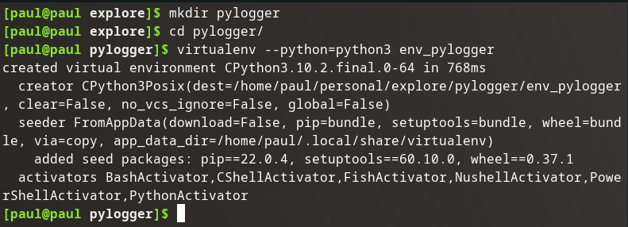

## Installing Dependencies into New Virtual Environment

I then activate the virtual environment so it is used from my shell instead of the globally installed python binary:

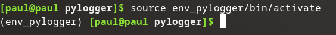

I then install all project dependencies with `pip` (in this case simply `pynput`):

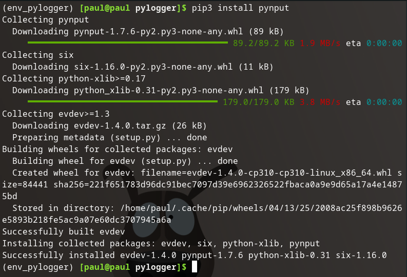

## Creating `requirements.txt`

I then dump out the full set of project dependencies to a new file called `requirements.txt`:

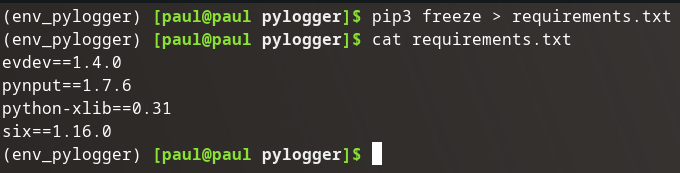

{}
The newly created `requirements.txt` can be used so this python environment can be easily re-created with pip by running `pip3 install -r requirements.txt`.
{}

## Enter Version Control

From here I initialize the project as a local git repository:

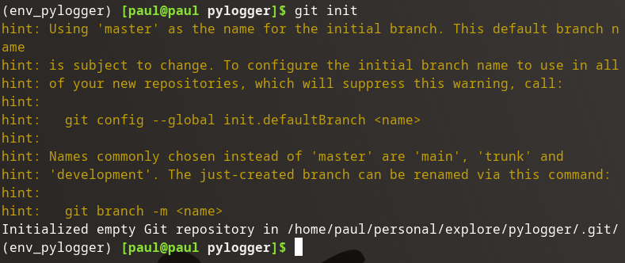

Add the virtual environment directory to the .gitignore:

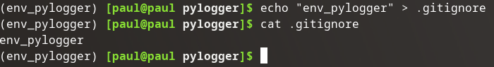

Add remote repo:

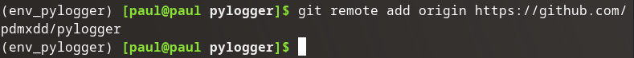

Stage our .gitignore and requirements.txt:

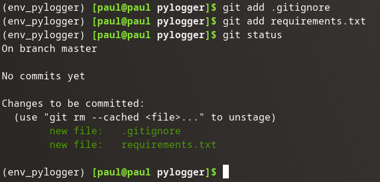

Commit:

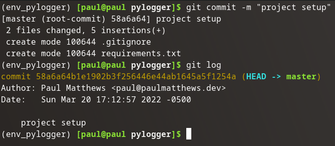

Push:

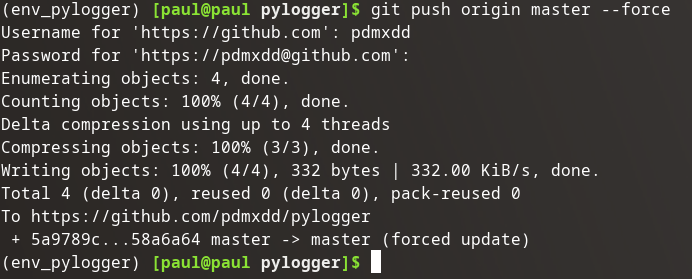

{}
I used the `--force` flag when I pushed, because the remote repo named origin (`https://github.com/pdmxdd/pylogger`) already had a version of this project. However, I am rebuilding this project from scratch and want to overwrite the contents of that remote repo. The `--force` option when used with `git push` will overwrite the remote repo with the contents of this local repo.
{}

Confirm on GitHub:

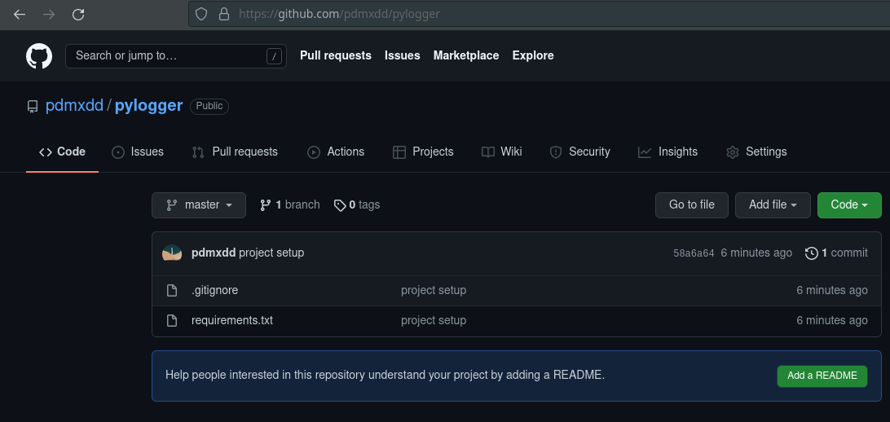

## Conclusion

Presto! 

I have:

- a project directory: (`pylogger/`)
- A local git repo (`pylogger/.git`)
  - ignoring dependency artifacts (`env_pylogger`)
  - instructions for creating dependency artifacts (`requirements.txt`)
- a remote git repo named origin: (`https://github.com/pdmxdd/pylogger`)

I am ready to start coding, and can easily move this project to a new computer, or begin working with project collaborators via git.